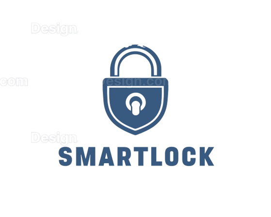

  

## Universidad Peruana de Ciencias Aplicadas

**Ingeniería de Software**

**Ciclo:** 2026-10

**Curso:** Desarrollo de Aplicaciones Open Source

**Sección:** 11881

**Profesor:** Efraín Ricardo Bautista Ubillús

----
## Informe de Trabajo Final
### SmartTecnologies

### SmartLock
#### Relación de integrantes
 

| Integrante                      | Código     |
|---------------------------------|------------|
| Palacios Tinoco Adrian Fernando | u202410817 |
| Peñaranda Caldas Gabriel Augusto| u202210836 |
| Huaman Oscco Aldo Jesus         | u20231h067 |
| Ayllon Pauccar Juan David       | u20241a860 |
|                                 |            |

 
<h3>Abril 2026</h3>
 

 

---
### Registro de Versiones

|**Versión**| **Fecha**  | **Autor**                                          | **Descripción de modificación**                                                                                                                 |
| - |------------|----------------------------------------------------|-------------------------------------------------------------------------------------------------------------------------------------------------|
|1\.0| 07/04/2026 | Adrian Fernando Palacios Tinoco                    | Se agrego parte de la estructura del capitulo I del informe, asimismo se agrego la carátula, el startup profile; y antecedentes y problemáticas |

  

---

# Capítulo I: Introducción

## 1.1. Startup Profile
### 1.1.1. Descripción de la Startup
**Área:** Seguridad Digital y Control de Accesos

**SmartTecnologies** es una startup formada por un equipo de estudiantes de ingeniería de software de la Universidad Peruana de Ciencias Aplicadas (UPC) que nace con la meta de proponer una alternativa moderna a los sistemas de seguridad tradicionales, que muchas veces se quedan cortos en control y trazabilidad. Identificamos que la gestión de llaves físicas y el registro manual de entradas son procesos lentos y poco fiables, por lo que desarrollamos Smart Lock. Nuestra solución es una plataforma web integral que permite administrar y monitorear el ingreso a cualquier espacio físico desde un solo lugar, transformando la seguridad convencional en un sistema inteligente basado en datos y control en tiempo real.

* **Misión:** Nuestra misión en SmartTecnologies es darle a los administradores y dueños de espacios una herramienta tecnológica avanzada que simplifique cómo controlan sus accesos. Con Smart Lock, buscamos que el proceso de decidir quién entra y quién no deje de ser una preocupación, ofreciendo un sistema basado en reglas claras y alertas automáticas que garantice que cada movimiento quede registrado de forma transparente y segura.
  
* **Visión:** Nos proyectamos como la startup líder en digitalización de accesos dentro de la región, logrando que nuestra tecnología sea el estándar en edificios, oficinas y centros de estudio. Queremos que SmartTecnologies sea sinónimo de modernidad y eficiencia, impulsando una cultura donde la seguridad no sea una barrera, sino un proceso fluido y totalmente automatizado.
  
* **Valores:**

    * **Seguridad y Confidencialidad:** Como estudiantes de Ingeniería de Software, sabemos que los datos de acceso son críticos. Por eso, nos tomamos muy en serio la protección de la información, usando protocolos de autenticación y cifrado para que solo las personas autorizadas tengan el control.

    * **Precisión en los datos:** Nos comprometemos con la exactitud en la gestión de presupuestos y tareas, asegurando que la información reflejada en la plataforma sea un espejo fiel de la realidad del proyecto.

    * **Innovación aplicada:** No nos conformamos con lo que ya existe. Buscamos aplicar lo aprendido en nuestra formación para integrar funciones como la simulación de flujo sin hardware y reglas de acceso dinámicas que mantengan a Smart Lock a la vanguardia.

    * **Gestión Colaborativa y Simple:** Creemos que la tecnología debe ser fácil de usar. Centralizamos todo en un panel intuitivo para que la comunicación entre administradores y usuarios sea rápida, eliminando complicaciones innecesarias.

    * **Compromiso con la Excelencia:** Trabajamos para que nuestra plataforma soporte las exigencias de un entorno real, ofreciendo una herramienta robusta que aguante el flujo constante de usuarios sin perder fiabilidad.
### 1.1.2. Perfiles de integrantes del equipo

|**Integrante**|**Perfil**|**Imagen**|
|:-------------|----------|:--------:|
| **Nombre y apellido**|
| **Nombre y apellido**|
| **Huaman Oscco Aldo Jesus - u20231h067**|Estudiante de la carrera de Ingeniería de Software en la Universidad Peruana de Ciencias Aplicadas (UPC). Actualmente cursando el 5to ciclo de la carrera, asumo la responsabilidad de investigar y aplicar conocimientos y habilidades de desarrollo en **SmarLock** de manera eficiente para culminarlo con exito.| |
| **Peñaranda Caldas Gabriel Augusto - u202210836**|Estudiante de la carrera de Ingeniería de Software en la Universidad Peruana de Ciencias Aplicadas (UPC). Me encuentro llevando cursos de 5to y 6to ciclo de la carrera. Cuento con habilidades sobresalientes en cloud, python, typescript y UX/UI. Además se ser alguien muy preocupado por mis compañeros de equipo y amigable que las demás personas. Me comprometo a que el proyecto **SmartLock** se lleve a cabo con éxito brindando responsabilidad y puntualidad en las entregas y avances del proyecto.| |
| **Palacios Tinoco Adrian Fernando - u202410817** | Estudiante de la carrera de Ingeniería de Software en la Universidad Peruana de Ciencias Aplicadas (UPC). Me encuentro cursando el 5to ciclo de la carrera. Cuento con habilidades tanto blandas como tecnicas. Por un lado, entre mis habilidades blandas destaco el trabajo en equipo, comunicacion efectiva y escucha activa. Por otro lado, mis habilidades entre mis habilidades tecnicas es el diseño de base de datos, analisis de requisitos, diseño de software y como lenguajes destaco mi conocimiento en C++, JavaScript, Python, Java y SQL. Me comprometo a que el proyecto **SmartLock** se lleve a cabo con éxito brindando responsabilidad y puntualidad en las entregas y avances del proyecto. |  |

## 1.2. Solution Profile
### 1.2.1. Antecedentes y problemática

**5W's y 2H's**

Para definir el problema central de Smart Lock, hemos aplicado la técnica de análisis detallado:
 

* **What?**
   
  La falta de un sistema centralizado, auditable y seguro para gestionar el ingreso de personal, lo que genera vulnerabilidades en la seguridad física y administrativa.  

* **Why?**
   
  Porque los sistemas convencionales no ofrecen trazabilidad. No se puede saber con certeza quién entró a una hora específica si no existe un registro digital automático y protegido contra alteraciones.   

* **Who?**
   
  Administradores de oficinas, gestores de espacios de coworking y dueños de propiedades residenciales o comerciales que carecen de un control estricto sobre sus accesos.  

* **When?**
   
  El problema se manifiesta diariamente, especialmente en horarios fuera de oficina o durante cambios de turno, donde el control se vuelve crítico y propenso a errores humanos.  

* **Where?**
   
  En entornos urbanos con alta densidad de oficinas y espacios compartidos donde el flujo de personas es constante y difícil de registrar manualmente.  

* **How?**
   
  La problemática se agrava mediante el uso de llaves duplicadas sin permiso, el olvido de registros en cuadernos físicos y la incapacidad de revocar accesos de manera inmediata ante una baja de personal.  

* **How much?**
   
  El costo de una brecha de seguridad o la pérdida de activos por un acceso no autorizado puede ascender a miles de soles, sumado al gasto constante en cerrajería tradicional que representa un flujo de caja ineficiente para las startups y PYMES.

### 1.2.2. Lean UX Process
#### 1.2.2.1. Lean UX Problem Statements
El dominio de nuestro producto es la gestión de seguridad y control de acceso a espacios físicos (Domain). Actualmente, nuestros administradores de edificios, dueños de negocios y personal de seguridad (Customer Segments) sufren por la falta de visibilidad en tiempo real, la dificultad para gestionar permisos temporales o por horarios, y la tediosa tarea de auditar accesos manualmente (Pain Points). Esto genera una brecha significativa de seguridad y eficiencia operativa frente a sistemas tradicionales que son inflexibles o ciegos ante anomalías (Gap).

Nuestra visión es proporcionar a las empresas una plataforma web inteligente y escalable que no solo permita o deniegue el acceso, sino que automatice el monitoreo mediante reglas, alertas y un historial detallado en tiempo real (Vision/Strategy). Para comenzar a validar nuestra solución, nos enfocaremos en un segmento inicial de pequeñas y medianas empresas (pymes) o espacios de coworking que requieran un control estricto de horarios para sus empleados sin invertir inicialmente en hardware complejo (Initial Segment).
#### 1.2.2.2. Lean UX Assumptions
**Business Assumptions (Suposiciones del Negocio):**

- Creemos que las empresas están dispuestas a pagar una suscripción mensual recurrente (modelo SaaS) en lugar de un pago único por un software de escritorio tradicional.

- Creemos que la simulación de acceso a puertas será suficiente para convencer a los primeros clientes (early adopters) del valor del software antes de integrarlo con hardware físico.

- Creemos que el límite de usuarios y de historial en el "Plan Básico" será el principal motivador para que los clientes escalen al "Plan Profesional".

**User Assumptions (Suposiciones del Usuario):**

- Creemos que el personal de monitoreo adoptará la verificación de dos pasos (2FA) sin considerarlo un bloqueo para su productividad.

- Creemos que los administradores valoran más recibir alertas automáticas (ej. intentos fallidos o fuera de horario) que revisar un historial de registros de forma manual.
#### 1.2.2.3. Lean UX Hypothesis Statements
- Hipótesis 1 (Alertas): Creemos que reduciremos el tiempo de respuesta ante incidentes de seguridad en un 50% si el personal de monitoreo logra identificar anomalías instantáneamente usando el sistema de alertas por intentos fallidos repetidos o accesos fuera de horario.

- Hipótesis 2 (Gestión de roles): Creemos que aumentaremos la adopción del Plan Profesional si los administradores de recursos humanos logran automatizar la entrada de su personal usando el control de acceso segmentado por franjas horarias y días laborales.

- Hipótesis 3 (Seguridad): Creemos que las empresas confiarán la auditoría de sus instalaciones a nuestra plataforma si los auditores internos logran rastrear exactamente quién autorizó un ingreso usando el historial detallado de eventos y la autenticación segura (2FA).

#### 1.2.2.4. Lean UX Canvas

| 1. Business Problem | 2. Business Outcomes |
| :------------------ | :------------------- |
| Las empresas pierden tiempo y vulneran su seguridad gestionando accesos con métodos inflexibles o sin monitoreo en tiempo real. | - Conseguir suscripciones al Plan Básico/Pro. - Alta retención mensual. - Reducción de incidentes de seguridad de los clientes. |
| **3. Users / Customers** | **4. User Benefits** |
| - Administradores de instalaciones / RRHH. - Personal de monitoreo / Prevención. - Empleados (usuarios finales). | - Tranquilidad al tener control total de quién entra y cuándo. - Ahorro de tiempo en auditorías. - Alertas automáticas sin esfuerzo manual. |
| **5. Solutions / Ideas** | **6. Hypotheses** |
| - Panel en tiempo real. - Sistema de reglas por horario y roles. - Motor de alertas de anomalías. - Log de auditoría inmutable. | - Creemos que reduciremos el tiempo de respuesta ante incidentes en un 50% si el personal logra identificar anomalías usando las alertas automáticas. - Creemos que aumentaremos la adopción del Plan Pro si RRHH logra automatizar la entrada usando el control por franjas horarias. |
| **7. What's the most important thing to learn first?** | **8. What's the least amount of work we need to do to learn this? (MVP)** |
| ¿Los administradores confiarán en la gestión de permisos a través de una interfaz web antes de conectar hardware real? | Construir la plataforma web funcional con la función de **Simulación de acceso a puertas** para demostrar el flujo lógico a clientes potenciales. |
### 1.3. Segmentos objetivo

---

Para el desarrollo de **Smart Lock**, se han definido los siguientes segmentos objetivo, integrando sus perfiles, necesidades y comportamientos en la gestión de accesos:

| **Segmento** | **Descripción del Perfil** | **Necesidades Principales** | **Características Psicográficas y Comportamentales** |
| :--- | :--- | :--- | :--- |
| **Gerentes de Operaciones, TI y Seguridad Corporativa** | Líderes responsables de una empresa preocupada por la infraestructura y seguridad de sus espacios de trabajo, desde startups en crecimiento hasta corporativos con múltiples oficinas y alto flujo de personal. | - Centralizar el control de accesos de múltiples sedes en una sola plataforma. - Eliminar la vulnerabilidad de las llaves físicas y tarjetas clonables. - Automatizar el registro de asistencia y la revocación inmediata de permisos a gran escala. | - Priorizan la escalabilidad y la integración con herramientas SaaS existentes. - Toman decisiones basadas en datos y registros de auditoría inmutables. - Buscan máxima eficiencia operativa reduciendo el error humano en porterías. |
| **Administradores de Eventos y Espacios de Alto Tráfico** | Profesionales encargados de la logística en centros de convenciones, ferias o complejos de oficinas que requieren gestionar entradas masivas por periodos específicos. | - Creación rápida de credenciales digitales temporales para invitados o contratistas. - Monitoreo en tiempo real de la ocupación por zonas para evitar aglomeraciones. - Despliegue del sistema sin depender de instalaciones de hardware pesadas o fijas. | - Valoran la agilidad y la capacidad de respuesta inmediata ante incidentes. - Están familiarizados con protocolos de seguridad dinámica (2FA y alertas móviles). - Prefieren interfaces intuitivas que permitan delegar tareas de control de forma sencilla. |

# Capítulo II: Requirements Elicitation & Analysis

## 2.1 Competidores

### **Kisi (Control de Acceso en la Nube)** 
Es una solución global de gestión de accesos de nivel empresarial que centraliza el control de múltiples instalaciones en una única interfaz basada en la nube. Se especializa en modernizar infraestructuras existentes sin necesidad de reemplazarlas por completo.
<https://www.getkisi.com/enterprise>

##### **Características Principales**
* **Gestión de Identidad Avanzada:** Permite asignar privilegios detallados por usuario e integra sistemas de autenticación **SSO** y protocolos **SCIM** para sincronizar la base de datos de empleados automáticamente.
* **Seguridad y Auditoría:** Facilita el cumplimiento de normativas de seguridad física mediante la obtención de datos vía **API** y la generación de informes automáticos personalizados.
* **Seguridad Multicapa:** Ofrece opciones de autenticación de dos factores (**2FA**) y **WebAuthn** para elevar los estándares de protección.
* **Implementación Híbrida:** Su gran diferencial es la capacidad de conectarse a cerraduras y lectores ya instalados, lo que reduce los costos de implementación hasta en un **65%**.

##### **Estructura de Planes**

| Plan | Descripción / Enfoque | Ideal para |
| :--- | :--- | :--- |
| **Standard** | Control básico en la nube. | Oficinas pequeñas. |
| **CRM** | Integración con sistemas de gestión de clientes. | Negocios con membresías. |
| **Enterprise** | Auditorías estrictas e integraciones de IT avanzadas. | Grandes corporaciones. |

---
<https://pages.getkisi.com/hubfs/kisi-pricing-overview.pdf>
  

### **Acceso Total Perú (Soluciones Integrales de Automatización)**
**Perfil de la Empresa:** Empresa peruana en fase de expansión con más de 5 años de experiencia en el sector de seguridad inteligente. Su competitividad radica en la flexibilidad de hardware y una sólida trayectoria con instituciones públicas y privadas de alto perfil (MININTER, MINCETUR, UNI, entre otros).

##### **Líneas de Servicio y Planes**
* **Control de Acceso para Puertas:** Sistema versátil con soporte para múltiples métodos de validación: códigos, tarjetas, huellas biométricas, reconocimiento facial y **códigos QR**.
* **Gestión de Asistencia Biométrica:** Solución especializada para **Recursos Humanos** que permite el control detallado de asistencias, faltas y horas extras con gestión local o centralizada.
* **Control de Acceso Vehicular:** Automatización de entradas y salidas de vehículos enfocada en la eficiencia operativa y reducción de costos de personal.
* **Control Peatonal Centralizado:** Implementación de barreras físicas (**torniquetes o molinetes**) gestionadas por un software integrado e intuitivo para flujos masivos.

##### **Valor Agregado**

| Beneficio | Descripción |
| :--- | :--- |
| **Asesoría Personalizada** | Acompañamiento técnico previo para determinar la viabilidad según la infraestructura. |
| **Experiencia Local** | Conocimiento profundo del mercado peruano y cumplimiento de estándares para entidades estatales. |

---
<https://accesototalperu.com/control-de-acceso-puerta/>
  

### **Kronos por SEIDOR (Gestión de Fuerza Laboral y Tiempo)**
**Descripción General:** Solución de alto nivel distribuida por **SEIDOR**, diseñada para el control integral de la jornada laboral y la optimización de la productividad. Su enfoque principal es el cumplimiento normativo y la eficiencia operativa en empresas con grandes planillas y turnos complejos.

#### **Pilares Estratégicos**
* **Optimización de Costos Operativos:** Alinea el personal con la demanda del negocio. Controla el pago de **horas extras** y proyecta el gasto de horas-hombre en tiempo real mediante alertas automáticas.
* **Mitigación de Riesgos y Cumplimiento:** Automatiza la generación de horarios asegurando el cumplimiento de la **legislación laboral** y acuerdos sindicales. Valida que el personal cuente con certificaciones vigentes antes de asignar turnos.
* **Productividad y Rendimiento:** Gestiona descansos obligatorios para prevenir el agotamiento y facilita la creación de equipos basados en competencias específicas.
* **Experiencia del Empleado (Self-Service):** Interfaz intuitiva para dispositivos móviles (**iOS y Android**) que permite a los colaboradores gestionar su disponibilidad y preferencias de turnos.

#### **Resumen de Valor**

| Enfoque | Objetivo Principal |
| :--- | :--- |
| **Financiero** | Control de presupuestos y reducción de sobrecostos laborales. |
| **Legal** | Automatización del cumplimiento de normativas vigentes. |
| **Humano** | Autogestión y bienestar del colaborador mediante movilidad. |

---
<https://www.seidor.com/es-pe/kronos>
  

### 2.1.1 Análisis Competitivo

# Competitive Analysis Landscape

> **¿Por qué llevar a cabo el desarrollo de un software de gestión de accesos habiendo modelos internacionales que gestionan la seguridad a nivel empresarial?**
> 
> **Objetivo:** [El objetivo de nuestro equipo es que los clientes vean nuestro software como una aplicación viable para la gestión de accesos de sus eventos o empresas, pudiendo ver reportes de asistencias, tardanzas e identificación de usuarios. Asimismo, facilitar la visualización de reportes que permitan analizar estadísticamente a sus colaboradores.]

| Sección | Detalle | SmartLock   | Kisi   | Acceso total Peru   | Kronos por Seidor   |
| :--- | :--- | :--- | :--- | :--- | :--- |
| **Perfil** | Overview | [Es un modelo de gestión de accesos "Asset-Light" que utiliza códigos QR dinámicos para eliminar la inversión en hardware, orientado a empresas y eventos que buscan una implementación inmediata, económica y escalable.] | [Es una solución de seguridad física basada en la nube que unifica el control de múltiples sedes globales en una sola interfaz, optimizando los costos de instalación al integrar infraestructura antigua con protocolos modernos de identidad (SSO/SCIM).] | [Se especializa en la integración de hardware y soporte técnico local, ofreciendo sistemas de barreras físicas y biometría para instituciones que requieren una fiscalización presencial estricta y cumplimiento de normativas nacionales.] | [Es una plataforma de Workforce Management estratégica enfocada en grandes corporaciones, cuyo objetivo es maximizar la rentabilidad del capital humano mediante la automatización de horarios complejos y el control de costos laborales.] |
| | Ventaja competitiva (¿Qué valor ofrece?) | [Optimiza la gestión de identidades mediante un modelo SaaS basado en códigos QR dinámicos, eliminando la dependencia de hardware costoso para ofrecer una solución ágil y de bajo costo en accesos corporativos y eventos temporales.] | [Se posiciona como una solución de control de accesos en la nube de nivel empresarial, cuyo objetivo es modernizar infraestructuras físicas antiguas integrándolas con sistemas de identidad avanzados como SSO y SCIM.] | [Se especializa en la integración de hardware y automatización local, enfocándose en la instalación de barreras físicas y sistemas biométricos para instituciones que requieren un control presencial robusto en el mercado peruano.] | [Ofrece una plataforma estratégica de Workforce Management, diseñada para grandes corporaciones que buscan maximizar la productividad y garantizar el cumplimiento legal mediante la gestión compleja de turnos y planillas.] |
| **Perfil de Marketing** | Mercado objetivo | [Se dirige a PYMES, startups y productoras de eventos que buscan una solución de acceso "ligera" y digital, priorizando la agilidad sobre la infraestructura física.] | [Su mercado son empresas tecnológicas y corporativos globales con múltiples sedes que necesitan centralizar la seguridad física en la nube e integrarla con su stack de IT (SSO/SCIM).] | [Enfocado en el sector público, industrial y educativo nacional, donde se requiere una fiscalización presencial estricta y soluciones de hardware robustas (torniquetes y biometría).] | [Orientada a grandes corporaciones con operaciones complejas (retail, manufactura, salud) que gestionan miles de empleados y requieren un control riguroso de normativas laborales.] |
| | Estrategias de marketing | [Basada en marketing digital, resaltando la facilidad de configuración, el ahorro en hardware y la flexibilidad del modelo por uso o suscripción.] | [Se posiciona mediante Inbound Marketing especializado en IT, ofreciendo contenido técnico sobre ciberseguridad física y eficiencia operativa para gerentes de tecnología y seguridad.] | [Utiliza una estrategia de ventas consultivas y licitaciones, apoyándose en su historial con el Estado y testimonios de grandes instituciones locales para generar confianza técnica.] | [Emplea un enfoque de ABM y eventos corporativos de alto nivel, posicionándose como un aliado estratégico para la transformación digital de Recursos Humanos.] |
| **Perfil de Producto** | Productos & Servicios | [Software de generación de QR dinámicos, panel de administración para gestión de planillas y módulos específicos para el control de asistencia en eventos masivos.] | [Controladores inteligentes de puertas, lectores compatibles con smartphones y una plataforma centralizada que integra autenticación de dos factores (2FA) con sistemas de oficina existentes.] | [Venta e instalación de terminales biométricos, molinetes y barreras vehiculares, acompañados de software de gestión local y servicios de mantenimiento preventivo.] | [Suite integral de Workforce Management que incluye módulos de planificación de horarios, control de fatiga, gestión de certificados y autoservicio para el empleado.] |
| | Precios & Costos | [Modelo de suscripción mensual escalable (SaaS) o pago por evento, eliminando los costos iniciales de instalación y mantenimiento de hardware especializado.] | [Estructura de precios por niveles (Standard, CRM, Enterprise) que combina una tarifa de software recurrente con el costo de adquisición de sus controladores propietarios.] | [Modelo de venta directa de activos (CAPEX) con un costo inicial alto por equipo e instalación, sumado a contratos opcionales de soporte técnico y licencias locales.] | [Inversión de nivel Enterprise que incluye costos significativos de consultoría, implementación personalizada y licencias anuales por volumen de empleados gestionados.] |
| | Canales de distribución | [Distribución 100% digital mediante plataforma Web para administración y App móvil nativa para que los usuarios finales validen sus accesos mediante QR.] | [Canal híbrido que utiliza plataforma Web para control global y aplicaciones móviles que emplean Bluetooth/NFC para la apertura de puertas físicas.] | [Distribución mediante ventas directas y consultoría presencial, utilizando interfaces de software locales (On-premise) o centralizadas para el monitoreo de hardware.] | [Ecosistema multi-dispositivo con interfaz Web robusta para la gestión administrativa y aplicaciones móviles (iOS/Android) enfocadas en la autogestión de turnos por el personal.] |
| **Análisis SWOT** | Fortalezas | [Su modelo "Asset-Light" basado en QR dinámicos elimina la inversión en hardware, permitiendo una implementación inmediata y costos operativos mínimos.] | [Excelente capacidad de integración híbrida, permitiendo gestionar infraestructuras antiguas desde una plataforma en la nube de nivel global.] | [Sólida presencia local y soporte técnico presencial, lo que les otorga una ventaja competitiva en licitaciones con el Estado y sector industrial.] | [Capacidad inigualable para gestionar cumplimiento legal y optimización de nómina en entornos corporativos con turnos altamente complejos.] |
| | Debilidades | [La dependencia total de la conectividad y batería del smartphone del usuario puede generar fricción en puntos de acceso de alta criticidad.] | [El costo de adquisición sigue siendo elevado debido a la necesidad de sus controladores propietarios para centralizar el mando.] | [Su modelo de negocio depende excesivamente de la venta e instalación de activos físicos (CAPEX), lo que dificulta una escalabilidad rápida.] | [Posee una curva de aprendizaje muy alta y procesos de implementación extremadamente largos y costosos para el cliente promedio.] |
| | Oportunidades | [Existe un mercado masivo en la digitalización de PYMES y eventos temporales que buscan seguridad profesional sin contratos de mantenimiento pesados.] | [El crecimiento del trabajo híbrido impulsa la demanda de soluciones que permitan gestionar oficinas desde cualquier parte del mundo.] | [Expansión hacia soluciones de ciudades inteligentes y automatización de edificios en el mercado inmobiliario peruano en auge.] | [La creciente regulación sobre el control de horas trabajadas y bienestar laboral obliga a las grandes empresas a adoptar sistemas tan robustos como este.] |
| | Amenazas | [La entrada de gigantes del software que integren funciones de acceso gratuitas en sus ecosistemas de oficina (como Microsoft o Google).] | [Startups con tecnologías puramente móviles (NFC/Bluetooth) que eliminan la necesidad de cualquier hardware intermedio.] | [El rechazo progresivo a los métodos de contacto físico (biometría de huella) frente a tecnologías de reconocimiento remoto o digital.] | [Herramientas de gestión de proyectos y comunicación que están añadiendo módulos de control de tiempo (Time Tracking) mucho más intuitivos.] |

### 2.1.2. Estrategias y tácticas frente a competidores.

### **Kisi (Control de Acceso en la Nube)** 
Es una solución global de gestión de accesos de nivel empresarial que centraliza el control de múltiples instalaciones en una única interfaz basada en la nube. Se especializa en modernizar infraestructuras existentes sin necesidad de reemplazarlas por completo.
<https://www.getkisi.com/enterprise>

##### **Características Principales**
* **Gestión de Identidad Avanzada:** Permite asignar privilegios detallados por usuario e integra sistemas de autenticación **SSO** y protocolos **SCIM** para sincronizar la base de datos de empleados automáticamente.
* **Seguridad y Auditoría:** Facilita el cumplimiento de normativas de seguridad física mediante la obtención de datos vía **API** y la generación de informes automáticos personalizados.
* **Seguridad Multicapa:** Ofrece opciones de autenticación de dos factores (**2FA**) y **WebAuthn** para elevar los estándares de protección.
* **Implementación Híbrida:** Su gran diferencial es la capacidad de conectarse a cerraduras y lectores ya instalados, lo que reduce los costos de implementación hasta en un **65%**.

##### **Estructura de Planes**

| Plan | Descripción / Enfoque | Ideal para |
| :--- | :--- | :--- |
| **Standard** | Control básico en la nube. | Oficinas pequeñas. |
| **CRM** | Integración con sistemas de gestión de clientes. | Negocios con membresías. |
| **Enterprise** | Auditorías estrictas e integraciones de IT avanzadas. | Grandes corporaciones. |

---
<https://pages.getkisi.com/hubfs/kisi-pricing-overview.pdf>
  

### **Acceso Total Perú (Soluciones Integrales de Automatización)**
**Perfil de la Empresa:** Empresa peruana en fase de expansión con más de 5 años de experiencia en el sector de seguridad inteligente. Su competitividad radica en la flexibilidad de hardware y una sólida trayectoria con instituciones públicas y privadas de alto perfil (MININTER, MINCETUR, UNI, entre otros).

##### **Líneas de Servicio y Planes**
* **Control de Acceso para Puertas:** Sistema versátil con soporte para múltiples métodos de validación: códigos, tarjetas, huellas biométricas, reconocimiento facial y **códigos QR**.
* **Gestión de Asistencia Biométrica:** Solución especializada para **Recursos Humanos** que permite el control detallado de asistencias, faltas y horas extras con gestión local o centralizada.
* **Control de Acceso Vehicular:** Automatización de entradas y salidas de vehículos enfocada en la eficiencia operativa y reducción de costos de personal.
* **Control Peatonal Centralizado:** Implementación de barreras físicas (**torniquetes o molinetes**) gestionadas por un software integrado e intuitivo para flujos masivos.

##### **Valor Agregado**

| Beneficio | Descripción |
| :--- | :--- |
| **Asesoría Personalizada** | Acompañamiento técnico previo para determinar la viabilidad según la infraestructura. |
| **Experiencia Local** | Conocimiento profundo del mercado peruano y cumplimiento de estándares para entidades estatales. |

---
<https://accesototalperu.com/control-de-acceso-puerta/>
  

### **Kronos por SEIDOR (Gestión de Fuerza Laboral y Tiempo)**
**Descripción General:** Solución de alto nivel distribuida por **SEIDOR**, diseñada para el control integral de la jornada laboral y la optimización de la productividad. Su enfoque principal es el cumplimiento normativo y la eficiencia operativa en empresas con grandes planillas y turnos complejos.

#### **Pilares Estratégicos**
* **Optimización de Costos Operativos:** Alinea el personal con la demanda del negocio. Controla el pago de **horas extras** y proyecta el gasto de horas-hombre en tiempo real mediante alertas automáticas.
* **Mitigación de Riesgos y Cumplimiento:** Automatiza la generación de horarios asegurando el cumplimiento de la **legislación laboral** y acuerdos sindicales. Valida que el personal cuente con certificaciones vigentes antes de asignar turnos.
* **Productividad y Rendimiento:** Gestiona descansos obligatorios para prevenir el agotamiento y facilita la creación de equipos basados en competencias específicas.
* **Experiencia del Empleado (Self-Service):** Interfaz intuitiva para dispositivos móviles (**iOS y Android**) que permite a los colaboradores gestionar su disponibilidad y preferencias de turnos.

#### **Resumen de Valor**

| Enfoque | Objetivo Principal |
| :--- | :--- |
| **Financiero** | Control de presupuestos y reducción de sobrecostos laborales. |
| **Legal** | Automatización del cumplimiento de normativas vigentes. |
| **Humano** | Autogestión y bienestar del colaborador mediante movilidad. |

---
<https://www.seidor.com/es-pe/kronos>
  

## 2.2 Entrevistas

### 2.2.1 Diseño de entrevistas

Para validar la propuesta de valor de **SmartLock**, se diseñaron entrevistas dirigidas a dos segmentos clave: **empresarios (dueños o administradores de negocios)** y **organizadores de eventos**, quienes enfrentan problemáticas relacionadas con el control de accesos y la seguridad en sus espacios.

El objetivo de estas entrevistas es comprender sus necesidades, problemas actuales, comportamientos y nivel de interés en una solución digital de control de accesos.

---

#### Segmento 1: Empresarios (dueños o administradores)

> **Objetivo:** Entender cómo gestionan actualmente el acceso a sus instalaciones, identificar problemas de seguridad y evaluar su disposición hacia soluciones digitales.

**Cuestionario de validación:**

1.  ¿Cómo gestionas actualmente el acceso de personas a tu negocio o instalaciones?
2.  ¿Qué tipo de problemas has tenido relacionados con el control de accesos?
3.  ¿Utilizas algún sistema digital o todo es manual? ¿Por qué?
4.  ¿Qué tan importante es para ti saber quién entra y sale en tiempo real?
5.  ¿Has tenido alguna situación de acceso no autorizado? ¿Cómo la manejaste?
6.  ¿Qué tan complicado es actualmente revocar el acceso a exempleados o terceros?
7.  ¿Qué herramientas utilizas para llevar un registro de accesos?
8.  ¿Cuánto tiempo inviertes en gestionar o supervisar estos accesos?
9.  ¿Qué características considerarías esenciales en un sistema de control de accesos?
10. ¿Estarías dispuesto a pagar por una solución que automatice este proceso? ¿Por qué?
11. ¿Qué nivel de confianza te generaría un sistema basado en la nube?
12. ¿Qué tan importante es para ti recibir alertas automáticas ante accesos sospechosos?
13. ¿Qué tan fácil debería ser implementar una solución como esta en tu negocio?
14. ¿Prefieres una solución sin hardware inicial (solo software)? ¿Por qué?
15. ¿Qué te haría decidirte por usar una plataforma como SmartLock?

---

#### Segmento 2: Organizadores de eventos

> **Objetivo:** Explorar cómo gestionan accesos en eventos, identificar dificultades operativas y validar oportunidades de mejora mediante tecnología.

**Cuestionario de validación:**

1.  ¿Cómo gestionas el ingreso de personas en los eventos que organizas?
2.  ¿Qué problemas has enfrentado al controlar accesos en eventos?
3.  ¿Cómo verificas la identidad o autorización de los asistentes?
4.  ¿Qué tan frecuente es que ocurran errores o accesos no autorizados?
5.  ¿Utilizas herramientas digitales para el control de ingreso? ¿Cuáles?
6.  ¿Qué tan importante es para ti tener un registro de asistencia en tiempo real?
7.  ¿Cómo manejas cambios de último momento en listas de invitados?
8.  ¿Qué tan complicado es coordinar el acceso con tu equipo de trabajo?
9.  ¿Has tenido problemas con sobreaforo o control de capacidad?
10. ¿Qué funcionalidades te gustaría tener en un sistema de control de accesos para eventos?
11. ¿Qué tan útil sería recibir alertas en tiempo real durante un evento?
12. ¿Estarías dispuesto a usar una plataforma web para gestionar accesos? ¿Por qué?
13. ¿Qué tan importante es la rapidez en el proceso de ingreso de asistentes?
14. ¿Qué te preocupa más: seguridad, rapidez o experiencia del usuario?
15. ¿Qué mejoras implementarías en tu proceso actual de control de accesos?

### 2.2.2 Registro de entrevistas

### 2.2.3 Análisis de entrevistas

## 2.3 Needfinding

### 2.3.1. User Personas.
### 2.3.2. User Task Matrix.
### 2.3.3. User Journey Mapping.
### 2.3.4. Empathy Mapping.
### 2.3.5. As-is Scenario Mapping.

## 2.4. Big Picture Event Storming.
## 2.5. Ubiquitous Language

# Capítulo III: Requirements Specification

## 3.1. User Stories.

---

## Historias de Usuario Funcionales (30)

| ID | Título | Descripción | Criterios de Aceptación (Gherkin) | Relacionado con |
| :--- | :--- | :--- | :--- | :--- |
| **HU-01** | Inicio de sesión estándar | Acceso al panel administrativo. | **Dado** que el administrador está en el login, **Cuando** ingresa correo y clave correctos, **Entonces** accede al panel de control. | **EPIC-01** |
| **HU-02** | Autenticación 2FA | Verificación de identidad reforzada. | **Dado** que el personal ingresó clave válida, **Cuando** el sistema procesa el primer paso, **Entonces** solicita código 2FA y valida que no haya expirado. | **EPIC-01** |
| **HU-03** | Creación de usuarios | Registro de empleados/miembros. | **Dado** que el admin de RRHH está en el módulo, **Cuando** ingresa datos requeridos y correo único, **Entonces** el sistema registra al usuario. | **EPIC-02** |
| **HU-04** | Asignación de roles | Gestión de niveles de permiso. | **Dado** que se edita un usuario, **Cuando** se selecciona un rol (Staff/Limpieza), **Entonces** se asignan permisos automáticos del rol. | **EPIC-02** |
| **HU-05** | Acceso días laborales | Restricción por calendario. | **Dado** que el usuario tiene acceso L-V, **Cuando** intenta acceder un sábado, **Entonces** el sistema deniega y registra el evento. | **EPIC-03** |
| **HU-06** | Acceso franjas horarias | Restricción por horas. | **Dado** que el acceso es de 9AM a 6PM, **Cuando** intenta acceder 6:05PM, **Entonces** deniega la entrada y genera registro fallido. | **EPIC-03** |
| **HU-07** | Accesos temporales | Permisos con caducidad. | **Dado** que el permiso vence a las 5:00PM, **Cuando** el reloj marca las 5:01PM, **Entonces** el permiso se revoca automáticamente. | **EPIC-03** |
| **HU-08** | Dashboard Real-Time | Visualización de eventos. | **Dado** que el dashboard está abierto, **Cuando** ocurre un evento en cualquier puerta, **Entonces** aparece en la lista sin recargar la página. | **EPIC-04** |
| **HU-09** | Simulación exitosa | Prueba de flujo sin hardware. | **Dado** que se usa la web sin cerraduras, **Cuando** se simula acceso en puerta permitida, **Entonces** registra evento exitoso en dashboard. | **EPIC-05** |
| **HU-10** | Simulación denegada | Prueba de reglas de negocio. | **Dado** que se usa el simulador, **Cuando** se simula acceso en horario no permitido, **Entonces** genera registro rojo y dispara alertas. | **EPIC-05** |
| **HU-11** | Alerta intentos fallidos | Detección de intrusos. | **Dado** que el sistema está activo, **Cuando** hay >3 fallos en 5 min, **Entonces** genera alerta visual de seguridad. | **EPIC-04** |
| **HU-12** | Alerta fuera de horario | Notificación preventiva. | **Dado** que el monitoreo corre, **Cuando** hay intento de apertura fuera de franja, **Entonces** genera notificación destacada en panel. | **EPIC-04** |
| **HU-13** | Historial detallado | Auditoría de movimientos. | **Dado** que se ingresa a "Historial", **Cuando** carga la vista, **Entonces** muestra lista paginada con usuario, fecha, hora, puerta y estado. | **EPIC-06** |
| **HU-14** | Filtros de historial | Búsqueda avanzada de eventos. | **Dado** que hay miles de registros, **Cuando** se filtra por estado y fecha, **Entonces** la tabla muestra solo los criterios coincidentes. | **EPIC-06** |
| **HU-15** | Límites Plan Básico | Bloqueo por suscripción. | **Dado** que se alcanzó el límite de usuarios, **Cuando** se intenta crear uno nuevo, **Entonces** muestra modal para mejorar al Plan Profesional. | **EPIC-07** |
| **HU-16** | Upgrade Profesional | Escalabilidad de cuenta. | **Dado** que se completa el pago del Plan Profesional, **Cuando** se confirma, **Entonces** elimina límites y desbloquea control avanzado. | **EPIC-07** |
| **HU-17** | Gestión multi-sede | Centralización operativa. | **Dado** que se tiene Plan Empresarial, **Cuando** se accede al panel, **Entonces** permite crear y cambiar entre Sedes independientes. | **EPIC-07** |
| **HU-18** | Reportes avanzados | Análisis de flujo. | **Dado** que se tiene Plan Empresarial, **Cuando** se pide reporte de horas pico, **Entonces** exporta PDF/Excel con gráficas. | **EPIC-06** |
| **HU-19** | Desactivación rápida | Revocación instantánea. | **Dado** que se visualiza lista de empleados, **Cuando** se pulsa "Desactivar", **Entonces** el acceso se revoca en tiempo real en toda la red. | **EPIC-02** |
| **HU-20** | Gestión de Puertas | CRUD de infraestructura. | **Dado** que se configura el espacio, **Cuando** se entra a "Puertas", **Entonces** permite crear, editar y eliminar puntos de acceso. | **EPIC-03** |
| **HU-21** | Acceso por puerta | Permisos granulares. | **Dado** que se edita el rol "Limpieza", **Cuando** se marcan puertas específicas, **Entonces** deniega acceso en el resto de puertas. | **EPIC-03** |
| **HU-22** | Alerta uso indebido | Prevención de espionaje. | **Dado** que hay zonas restringidas, **Cuando** hay intento sin autorización, **Entonces** etiqueta como "Uso indebido" y emite alerta. | **EPIC-04** |
| **HU-23** | Reset de contraseña | Autogestión de cuenta. | **Dado** que el usuario olvidó su clave, **Cuando** la solicita, **Entonces** recibe enlace tokenizado válido por 15 minutos. | **EPIC-01** |
| **HU-24** | Exportación de datos | Descarga de reportes. | **Dado** que se aplicaron filtros en historial, **Cuando** se pulsa "Exportar", **Entonces** descarga CSV con los registros filtrados. | **EPIC-06** |
| **HU-25** | Cierre de alertas | Gestión de incidencias. | **Dado** que hay alerta activa, **Cuando** se pulsa "Resolver", **Entonces** desaparece de la vista y se archiva como resuelta. | **EPIC-04** |
| **HU-26** | Cierre de sesión | Seguridad de terminal. | **Dado** que el usuario está logueado, **Cuando** pulsa "Cerrar sesión", **Entonces** destruye el token y redirige al login. | **EPIC-01** |
| **HU-27** | Invitación masiva | Onboarding eficiente. | **Dado** que se carga lista de correos, **Cuando** se envía, **Entonces** cada empleado recibe link único para crear su clave. | **EPIC-02** |
| **HU-28** | Edición de perfil | Actualización de datos. | **Dado** que el usuario está autenticado, **Cuando** edita su perfil, **Entonces** permite cambiar foto/teléfono pero bloquea cambio de rol. | **EPIC-01** |
| **HU-29** | Alerta desconexión | Monitoreo de hardware. | **Dado** que se monitorea hardware, **Cuando** una puerta pierde red, **Entonces** el ícono en dashboard cambia a "Offline" o rojo. | **EPIC-04** |
| **HU-30** | Notificación crítica | Alerta vía email. | **Dado** que hay notificaciones activas, **Cuando** ocurre emergencia (madrugada), **Entonces** envía email automático al dueño. | **EPIC-04** |

---

## Historias de Usuario No Funcionales (30)

| ID | Título | Descripción | Criterios de Aceptación (Gherkin) | Relacionado con |
| :--- | :--- | :--- | :--- | :--- |
| **HNF-01** | Latencia Dashboard | Actualización inmediata. | **Dado** que ocurre validación en puerta, **Cuando** la DB registra el evento, **Entonces** actualiza el dashboard en < 1 segundo. | **EPIC-08** |
| **HNF-02** | Rendimiento carga | Carga de plataforma. | **Dado** que se ingresa a la URL, **Cuando** el navegador pide recursos, **Entonces** la página es interactiva en un máximo de 2 segundos. | **EPIC-08** |
| **HNF-03** | Encriptación | Hashing de seguridad. | **Dado** que se crea/cambia clave, **Cuando** se guarda en DB, **Entonces** debe usarse bcrypt y nunca texto plano. | **EPIC-09** |
| **HNF-04** | Datos en tránsito | Cifrado de red. | **Dado** que la web habla con la API, **Cuando** viajan datos sensibles, **Entonces** debe usarse HTTPS con TLS 1.2+. | **EPIC-09** |
| **HNF-05** | Disponibilidad | Continuidad operativa. | **Dado** que el sistema está en producción, **Cuando** se mide el uptime mensual, **Entonces** debe ser >= 99.9%. | **EPIC-08** |
| **HNF-06** | Diseño Responsivo | Adaptabilidad móvil. | **Dado** que se usa un móvil (320px), **Cuando** accede al panel, **Entonces** la interfaz adapta elementos sin pérdida de función. | **EPIC-10** |
| **HNF-07** | Inmutabilidad logs | Integridad de auditoría. | **Dado** que un evento se escribió en DB, **Cuando** un admin intenta borrarlo, **Entonces** la API debe rechazar el UPDATE/DELETE. | **EPIC-06** |
| **HNF-08** | Escalabilidad | Capacidad de carga. | **Dado** que es hora pico (9AM), **Cuando** hay 500 peticiones simultáneas, **Entonces** el servidor responde en < 500ms sin caídas. | **EPIC-08** |
| **HNF-09** | Timeout sesión | Protección por olvido. | **Dado** que la sesión quedó abierta, **Cuando** pasan 15 min sin actividad, **Entonces** destruye sesión y redirige al login. | **EPIC-09** |
| **HNF-10** | Compatibilidad | Multi-navegador. | **Dado** que se usa Chrome/Safari/Firefox, **Cuando** se abre la plataforma, **Entonces** debe renderizar sin fallos visuales ni de consola. | **EPIC-10** |
| **HNF-11** | Tolerancia fallos | Aislamiento de errores. | **Dado** que el simulador tiene un crash, **Cuando** el usuario navega el resto, **Entonces** dashboard e historial siguen operando. | **EPIC-08** |
| **HNF-12** | Velocidad 2FA/Email | Entrega de correos. | **Dado** que se pide 2FA, **Cuando** se dispara solicitud, **Entonces** el correo llega en < 5 segundos a la bandeja del usuario. | **EPIC-08** |
| **HNF-13** | Accesibilidad | Normas WCAG. | **Dado** que se evalúan colores, **Cuando** se mide el contraste, **Entonces** debe cumplir nivel AA de WCAG 2.1. | **EPIC-10** |
| **HNF-14** | Anti-Brute Force | Bloqueo de ataques. | **Dado** que hay ataque de clave, **Cuando** hay 5 fallos en mismo correo, **Entonces** bloquea IP/Cuenta por 30 minutos. | **EPIC-09** |
| **HNF-15** | Data Isolation | Multi-tenancy real. | **Dado** que es un SaaS multi-empresa, **Cuando** un admin consulta, **Entonces** el esquema garantiza que no vea datos de otros clientes. | **EPIC-09** |
| **HNF-16** | Backups diarios | Respaldo de datos. | **Dado** que la info es crítica, **Cuando** es la ventana de mantenimiento, **Entonces** genera backup automático en nube segregada. | **EPIC-09** |
| **HNF-17** | Log de auditoría | Trazabilidad admin. | **Dado** que un admin cambia configuración, **Cuando** se ejecuta, **Entonces** registra quién, cuándo y qué cambió en log oculto. | **EPIC-06** |
| **HNF-18** | Mensajes de error | UX de fallos. | **Dado** que hay fallo de base de datos, **Cuando** la API falla, **Entonces** el frontend muestra mensaje amigable sin detalles técnicos. | **EPIC-10** |
| **HNF-19** | Rate Limiting | Protección de API. | **Dado** que un bot ataca la API, **Cuando** hay >100 req/min desde una IP, **Entonces** el Gateway bloquea con error 429. | **EPIC-09** |
| **HNF-20** | Velocidad Export | Procesamiento masivo. | **Dado** que se exportan 10,000 registros, **Cuando** se procesa, **Entonces** entrega el archivo en < 10 segundos. | **EPIC-08** |
| **HNF-21** | Complejidad clave | Validación de fortaleza. | **Dado** que se configura clave, **Cuando** es débil (1234), **Entonces** rechaza y exige 8 carac., número y símbolo. | **EPIC-09** |
| **HNF-22** | Soporte i18n | Internacionalización. | **Dado** que se desarrolla el código, **Cuando** se implementan textos, **Entonces** se envuelven en i18n para futuras traducciones. | **EPIC-11** |
| **HNF-23** | RTO | Recuperación desastres. | **Dado** que hay desastre total, **Cuando** se activa el DRP, **Entonces** el sistema opera en región secundaria en máximo 4 horas. | **EPIC-08** |
| **HNF-24** | Archivado datos | Cold Storage. | **Dado** que hay millones de registros, **Cuando** un log cumple 2 años, **Entonces** se mueve automáticamente a almacenamiento en frío. | **EPIC-06** |
| **HNF-25** | Consumo batería | Optimización móvil. | **Dado** que el dashboard corre 8h en tablet, **Cuando** se mide consumo, **Entonces** no debe causar drenaje excesivo ni calor. | **EPIC-08** |
| **HNF-26** | Seguridad OWASP | Sanitización de inputs. | **Dado** que hay ataque XSS/SQLi, **Cuando** se envían datos, **Entonces** el backend sanitiza y usa consultas parametrizadas. | **EPIC-09** |
| **HNF-27** | Sincronía NTP | Precisión temporal. | **Dado** que el log tiene valor legal, **Cuando** se registra evento, **Entonces** el servidor usa NTP para sincronía global exacta. | **EPIC-09** |
| **HNF-28** | Regla 3 clics | Arquitectura intuitiva. | **Dado** que se busca una función, **Cuando** se navega desde dashboard, **Entonces** se debe completar en máximo 3 clics. | **EPIC-10** |
| **HNF-29** | Design System | Consistencia UI. | **Dado** que hay nuevas pantallas, **Cuando** el usuario navega, **Entonces** los colores/espaciados deben ser uniformes. | **EPIC-10** |
| **HNF-30** | Health Checks | Monitoreo de salud. | **Dado** que falla un microservicio, **Cuando** el monitor consulta /health, **Entonces** detecta y notifica antes del reporte del cliente. | **EPIC-08** |

---

## Definición de Epics (Módulos Generales)

| Epic ID | Nombre de la Epic | Descripción |
| :--- | :--- | :--- |
| **EPIC-01** | **Gestión de Identidad y Cuenta** | Todo lo relacionado con autenticación, seguridad de perfil y acceso inicial al sistema. |
| **EPIC-02** | **Administración de Personal (RRHH)** | Gestión del ciclo de vida del usuario: creación, asignación de roles, desactivación e invitaciones. |
| **EPIC-03** | **Configuración de Infraestructura y Reglas** | Definición de puertas físicas y las reglas de negocio (horarios, días, accesos temporales). |
| **EPIC-04** | **Centro de Monitoreo y Alertas** | El "corazón" operativo: dashboard en tiempo real, gestión de alertas e indicadores de estado. |
| **EPIC-05** | **Entorno de Simulación (Virtual Lock)** | Módulo para clientes sin hardware que permite probar la lógica de acceso digitalmente. |
| **EPIC-06** | **Auditoría, Reportes e Integridad** | Registro histórico, exportación de datos, analítica avanzada y protección de la inmutabilidad de logs. |
| **EPIC-07** | **Ecosistema Comercial y Suscripciones** | Manejo de tiers (Básico, Pro, Enterprise), límites de cuenta y gestión multi-sede. |
| **EPIC-08** | **Rendimiento, Disponibilidad y Escalabilidad** | Calidad del sistema en términos de velocidad, estabilidad frente a carga y recuperación ante fallos. |
| **EPIC-09** | **Capa de Seguridad y Ciberdefensa** | Normas técnicas de encriptación, protocolos de red, protección contra ataques y privacidad de datos. |
| **EPIC-10** | **Experiencia de Usuario (UX/UI)** | Consistencia visual, accesibilidad, diseño responsivo y usabilidad general. |
| **EPIC-11** | **Escalabilidad Global e i18n** | Preparación técnica del software para mercados internacionales y multi-idioma. |

## 3.2. Impact Mapping

## 3.3. Product Backlog

---
# Capítulo IV: Product Design

## 4.1. Style Guidelines.
Se describen las directrices que aseguran la uniformidad 
estética del proyecto. 

**Colors:**
 
  Elegimos una paleta que grite **seguridad y tecnología**, pero sin cansar la vista (pensando en administradores que estarán pegados al dashboard monitoreando accesos).
 
* **Azul Oscuro (#1B263B):** Es nuestro color estrella. Da esa seriedad y confianza que necesitas cuando hablas de controlar quién entra a tu edificio u oficina.
* **Casi Negro (#0D1B2A):** Lo usamos para los textos importantes. No es negro puro porque eso agota la vista en sesiones largas, pero tiene el peso suficiente para que se lea claro.
* **Gris Neutro (#E0E1DD):** Este va de fondo en las secciones. Es limpio y hace que los demás elementos resalten sin esfuerzo.
* **Azul Eléctrico (#3E92CC):** Este es nuestro "call to action". Si hay algo que el usuario tiene que clickear sí o sí (como el botón de "Abrir Puerta" o "Guardar Configuración"), va en este color.

**Branding** 
El logo de **SmartLock** es directo al grano: un **candado**. Elegimos este isotipo porque es el símbolo universal de la seguridad física; no necesitamos complicarlo con más adornos para que el usuario entienda qué hacemos. Lo que lo hace moderno es su diseño minimalista y limpio. Acompañando al candado, la tipografía del nombre es sólida y de cortes precisos. Queríamos que la identidad visual transmitiera esa firmeza y robustez que se espera de un sistema de seguridad confiable, alejándonos de cualquier estética que pudiera parecer "frágil" o improvisada.

**Typography**  
Nos fuimos por **Inter**. ¿Por qué? Porque cuando tienes una lista gigante de registros de entrada y salida, necesitas una letra que se lea perfecto en pantallas de cualquier tamaño. Es una fuente *sans-serif* optimizada para entornos digitales.

### 4.1.1. General Style Guidelines.
### 4.1.2. Web Style Guidelines.
## 4.2. Information Architecture.
### 4.2.1. Organization Systems.
### 4.2.2. Labeling Systems.
### 4.2.3. SEO Tags and Meta Tags
### 4.2.4. Searching Systems.
### 4.2.5. Navigation Systems.
## 4.3. Landing Page UI Design.
### 4.3.1. Landing Page Wireframe.
### 4.3.2. Landing Page Mock-up.
## 4.4. Web Applications UX/UI Design.
### 4.4.1. Web Applications Wireframes.
### 4.4.2. Web Applications Wireflow Diagrams.
### 4.4.3. Web Applications Mock-ups.
### 4.4.4. Web Applications User Flow Diagrams.
## 4.5. Web Applications Prototyping.
## 4.6. Domain-Driven Software Architecture.
### 4.6.1. Design-Level Event Storming.
### 4.6.2. Software Architecture Context Diagram.
### 4.6.3. Software Architecture Container Diagrams.
### 4.6.4. Software Architecture Components Diagrams.
## 4.7. Software Object-Oriented Design.
### 4.7.1. Class Diagrams.
## 4.8. Database Design.
### 4.8.1. Database Diagrams.

---
# Capítulo V: Product Implementation, Validation & Deployment.
## 5.1. Software Configuration Management.
### 5.1.1. Software Development Environment Configuration.
### 5.1.2. Source Code Management.
### 5.1.3. Source Code Style Guide & Conventions.
### 5.1.4. Software Deployment Configuration.
## 5.2. Landing Page, Services & Applications Implementation.
### 5.2.1. Sprint 1
#### 5.2.1.1. Sprint Planning 1.
#### 5.2.1.2. Aspect Leaders and Collaborators.
#### 5.2.1.3. Sprint Backlog 1.
#### 5.2.1.4. Development Evidence for Sprint Review.
#### 5.2.1.5. Execution Evidence for Sprint Review.
#### 5.2.1.6. Services Documentation Evidence for Sprint Review.
#### 5.2.1.7. Software Deployment Evidence for Sprint Review.
#### 5.2.1.8. Team Collaboration Insights during Sprint.
## 5.3. Validation Interviews.
### 5.3.1. Diseño de Entrevistas.
### 5.3.2. Registro de Entrevistas.
### 5.3.3. Evaluaciones según heurísticas.
## 5.4. Video About-the-Product.
---
# Conclusiones
# Bibliografía

# Anexos