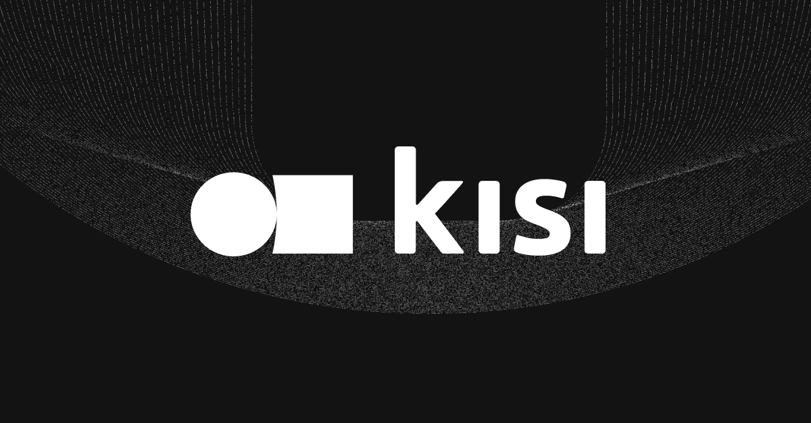
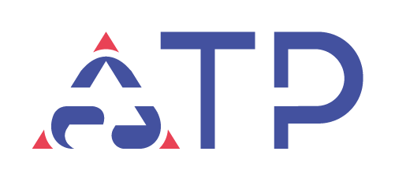
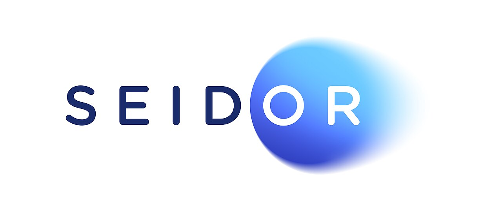

# Capítulo II: Requirements Elicitation & Analysis

## 2.1 Competidores

### **Kisi (Control de Acceso en la Nube)** 
Es una solución global de gestión de accesos de nivel empresarial que centraliza el control de múltiples instalaciones en una única interfaz basada en la nube. Se especializa en modernizar infraestructuras existentes sin necesidad de reemplazarlas por completo.
<https://www.getkisi.com/enterprise>

##### **Características Principales**
* **Gestión de Identidad Avanzada:** Permite asignar privilegios detallados por usuario e integra sistemas de autenticación **SSO** y protocolos **SCIM** para sincronizar la base de datos de empleados automáticamente.
* **Seguridad y Auditoría:** Facilita el cumplimiento de normativas de seguridad física mediante la obtención de datos vía **API** y la generación de informes automáticos personalizados.
* **Seguridad Multicapa:** Ofrece opciones de autenticación de dos factores (**2FA**) y **WebAuthn** para elevar los estándares de protección.
* **Implementación Híbrida:** Su gran diferencial es la capacidad de conectarse a cerraduras y lectores ya instalados, lo que reduce los costos de implementación hasta en un **65%**.

##### **Estructura de Planes**

| Plan | Descripción / Enfoque | Ideal para |
| :--- | :--- | :--- |
| **Standard** | Control básico en la nube. | Oficinas pequeñas. |
| **CRM** | Integración con sistemas de gestión de clientes. | Negocios con membresías. |
| **Enterprise** | Auditorías estrictas e integraciones de IT avanzadas. | Grandes corporaciones. |

---
<https://pages.getkisi.com/hubfs/kisi-pricing-overview.pdf>
  

### **Acceso Total Perú (Soluciones Integrales de Automatización)**
**Perfil de la Empresa:** Empresa peruana en fase de expansión con más de 5 años de experiencia en el sector de seguridad inteligente. Su competitividad radica en la flexibilidad de hardware y una sólida trayectoria con instituciones públicas y privadas de alto perfil (MININTER, MINCETUR, UNI, entre otros).

##### **Líneas de Servicio y Planes**
* **Control de Acceso para Puertas:** Sistema versátil con soporte para múltiples métodos de validación: códigos, tarjetas, huellas biométricas, reconocimiento facial y **códigos QR**.
* **Gestión de Asistencia Biométrica:** Solución especializada para **Recursos Humanos** que permite el control detallado de asistencias, faltas y horas extras con gestión local o centralizada.
* **Control de Acceso Vehicular:** Automatización de entradas y salidas de vehículos enfocada en la eficiencia operativa y reducción de costos de personal.
* **Control Peatonal Centralizado:** Implementación de barreras físicas (**torniquetes o molinetes**) gestionadas por un software integrado e intuitivo para flujos masivos.

##### **Valor Agregado**

| Beneficio | Descripción |
| :--- | :--- |
| **Asesoría Personalizada** | Acompañamiento técnico previo para determinar la viabilidad según la infraestructura. |
| **Experiencia Local** | Conocimiento profundo del mercado peruano y cumplimiento de estándares para entidades estatales. |

---
<https://accesototalperu.com/control-de-acceso-puerta/>
  

### **Kronos por SEIDOR (Gestión de Fuerza Laboral y Tiempo)**
**Descripción General:** Solución de alto nivel distribuida por **SEIDOR**, diseñada para el control integral de la jornada laboral y la optimización de la productividad. Su enfoque principal es el cumplimiento normativo y la eficiencia operativa en empresas con grandes planillas y turnos complejos.

#### **Pilares Estratégicos**
* **Optimización de Costos Operativos:** Alinea el personal con la demanda del negocio. Controla el pago de **horas extras** y proyecta el gasto de horas-hombre en tiempo real mediante alertas automáticas.
* **Mitigación de Riesgos y Cumplimiento:** Automatiza la generación de horarios asegurando el cumplimiento de la **legislación laboral** y acuerdos sindicales. Valida que el personal cuente con certificaciones vigentes antes de asignar turnos.
* **Productividad y Rendimiento:** Gestiona descansos obligatorios para prevenir el agotamiento y facilita la creación de equipos basados en competencias específicas.
* **Experiencia del Empleado (Self-Service):** Interfaz intuitiva para dispositivos móviles (**iOS y Android**) que permite a los colaboradores gestionar su disponibilidad y preferencias de turnos.

#### **Resumen de Valor**

| Enfoque | Objetivo Principal |
| :--- | :--- |
| **Financiero** | Control de presupuestos y reducción de sobrecostos laborales. |
| **Legal** | Automatización del cumplimiento de normativas vigentes. |
| **Humano** | Autogestión y bienestar del colaborador mediante movilidad. |

---
<https://www.seidor.com/es-pe/kronos>
  

### 2.1.1 Análisis Competitivo

# Competitive Analysis Landscape

> **¿Por qué llevar a cabo el desarrollo de un software de gestión de accesos habiendo modelos internacionales que gestionan la seguridad a nivel empresarial?**
> 
> **Objetivo:** [El objetivo de nuestro equipo es que los clientes vean nuestro software como una aplicación viable para la gestión de accesos de sus eventos o empresas, pudiendo ver reportes de asistencias, tardanzas e identificación de usuarios. Asimismo, facilitar la visualización de reportes que permitan analizar estadísticamente a sus colaboradores.]

| Sección | Detalle | SmartLock   | Kisi   | Acceso total Peru   | Kronos por Seidor   |
| :--- | :--- | :--- | :--- | :--- | :--- |
| **Perfil** | Overview | [Es un modelo de gestión de accesos "Asset-Light" que utiliza códigos QR dinámicos para eliminar la inversión en hardware, orientado a empresas y eventos que buscan una implementación inmediata, económica y escalable.] | [Es una solución de seguridad física basada en la nube que unifica el control de múltiples sedes globales en una sola interfaz, optimizando los costos de instalación al integrar infraestructura antigua con protocolos modernos de identidad (SSO/SCIM).] | [Se especializa en la integración de hardware y soporte técnico local, ofreciendo sistemas de barreras físicas y biometría para instituciones que requieren una fiscalización presencial estricta y cumplimiento de normativas nacionales.] | [Es una plataforma de Workforce Management estratégica enfocada en grandes corporaciones, cuyo objetivo es maximizar la rentabilidad del capital humano mediante la automatización de horarios complejos y el control de costos laborales.] |
| | Ventaja competitiva (¿Qué valor ofrece?) | [Optimiza la gestión de identidades mediante un modelo SaaS basado en códigos QR dinámicos, eliminando la dependencia de hardware costoso para ofrecer una solución ágil y de bajo costo en accesos corporativos y eventos temporales.] | [Se posiciona como una solución de control de accesos en la nube de nivel empresarial, cuyo objetivo es modernizar infraestructuras físicas antiguas integrándolas con sistemas de identidad avanzados como SSO y SCIM.] | [Se especializa en la integración de hardware y automatización local, enfocándose en la instalación de barreras físicas y sistemas biométricos para instituciones que requieren un control presencial robusto en el mercado peruano.] | [Ofrece una plataforma estratégica de Workforce Management, diseñada para grandes corporaciones que buscan maximizar la productividad y garantizar el cumplimiento legal mediante la gestión compleja de turnos y planillas.] |
| **Perfil de Marketing** | Mercado objetivo | [Se dirige a PYMES, startups y productoras de eventos que buscan una solución de acceso "ligera" y digital, priorizando la agilidad sobre la infraestructura física.] | [Su mercado son empresas tecnológicas y corporativos globales con múltiples sedes que necesitan centralizar la seguridad física en la nube e integrarla con su stack de IT (SSO/SCIM).] | [Enfocado en el sector público, industrial y educativo nacional, donde se requiere una fiscalización presencial estricta y soluciones de hardware robustas (torniquetes y biometría).] | [Orientada a grandes corporaciones con operaciones complejas (retail, manufactura, salud) que gestionan miles de empleados y requieren un control riguroso de normativas laborales.] |
| | Estrategias de marketing | [Basada en marketing digital, resaltando la facilidad de configuración, el ahorro en hardware y la flexibilidad del modelo por uso o suscripción.] | [Se posiciona mediante Inbound Marketing especializado en IT, ofreciendo contenido técnico sobre ciberseguridad física y eficiencia operativa para gerentes de tecnología y seguridad.] | [Utiliza una estrategia de ventas consultivas y licitaciones, apoyándose en su historial con el Estado y testimonios de grandes instituciones locales para generar confianza técnica.] | [Emplea un enfoque de ABM y eventos corporativos de alto nivel, posicionándose como un aliado estratégico para la transformación digital de Recursos Humanos.] |
| **Perfil de Producto** | Productos & Servicios | [Software de generación de QR dinámicos, panel de administración para gestión de planillas y módulos específicos para el control de asistencia en eventos masivos.] | [Controladores inteligentes de puertas, lectores compatibles con smartphones y una plataforma centralizada que integra autenticación de dos factores (2FA) con sistemas de oficina existentes.] | [Venta e instalación de terminales biométricos, molinetes y barreras vehiculares, acompañados de software de gestión local y servicios de mantenimiento preventivo.] | [Suite integral de Workforce Management que incluye módulos de planificación de horarios, control de fatiga, gestión de certificados y autoservicio para el empleado.] |
| | Precios & Costos | [Modelo de suscripción mensual escalable (SaaS) o pago por evento, eliminando los costos iniciales de instalación y mantenimiento de hardware especializado.] | [Estructura de precios por niveles (Standard, CRM, Enterprise) que combina una tarifa de software recurrente con el costo de adquisición de sus controladores propietarios.] | [Modelo de venta directa de activos (CAPEX) con un costo inicial alto por equipo e instalación, sumado a contratos opcionales de soporte técnico y licencias locales.] | [Inversión de nivel Enterprise que incluye costos significativos de consultoría, implementación personalizada y licencias anuales por volumen de empleados gestionados.] |
| | Canales de distribución | [Distribución 100% digital mediante plataforma Web para administración y App móvil nativa para que los usuarios finales validen sus accesos mediante QR.] | [Canal híbrido que utiliza plataforma Web para control global y aplicaciones móviles que emplean Bluetooth/NFC para la apertura de puertas físicas.] | [Distribución mediante ventas directas y consultoría presencial, utilizando interfaces de software locales (On-premise) o centralizadas para el monitoreo de hardware.] | [Ecosistema multi-dispositivo con interfaz Web robusta para la gestión administrativa y aplicaciones móviles (iOS/Android) enfocadas en la autogestión de turnos por el personal.] |
| **Análisis SWOT** | Fortalezas | [Su modelo "Asset-Light" basado en QR dinámicos elimina la inversión en hardware, permitiendo una implementación inmediata y costos operativos mínimos.] | [Excelente capacidad de integración híbrida, permitiendo gestionar infraestructuras antiguas desde una plataforma en la nube de nivel global.] | [Sólida presencia local y soporte técnico presencial, lo que les otorga una ventaja competitiva en licitaciones con el Estado y sector industrial.] | [Capacidad inigualable para gestionar cumplimiento legal y optimización de nómina en entornos corporativos con turnos altamente complejos.] |
| | Debilidades | [La dependencia total de la conectividad y batería del smartphone del usuario puede generar fricción en puntos de acceso de alta criticidad.] | [El costo de adquisición sigue siendo elevado debido a la necesidad de sus controladores propietarios para centralizar el mando.] | [Su modelo de negocio depende excesivamente de la venta e instalación de activos físicos (CAPEX), lo que dificulta una escalabilidad rápida.] | [Posee una curva de aprendizaje muy alta y procesos de implementación extremadamente largos y costosos para el cliente promedio.] |
| | Oportunidades | [Existe un mercado masivo en la digitalización de PYMES y eventos temporales que buscan seguridad profesional sin contratos de mantenimiento pesados.] | [El crecimiento del trabajo híbrido impulsa la demanda de soluciones que permitan gestionar oficinas desde cualquier parte del mundo.] | [Expansión hacia soluciones de ciudades inteligentes y automatización de edificios en el mercado inmobiliario peruano en auge.] | [La creciente regulación sobre el control de horas trabajadas y bienestar laboral obliga a las grandes empresas a adoptar sistemas tan robustos como este.] |
| | Amenazas | [La entrada de gigantes del software que integren funciones de acceso gratuitas en sus ecosistemas de oficina (como Microsoft o Google).] | [Startups con tecnologías puramente móviles (NFC/Bluetooth) que eliminan la necesidad de cualquier hardware intermedio.] | [El rechazo progresivo a los métodos de contacto físico (biometría de huella) frente a tecnologías de reconocimiento remoto o digital.] | [Herramientas de gestión de proyectos y comunicación que están añadiendo módulos de control de tiempo (Time Tracking) mucho más intuitivos.] |

###2.1.2. Estrategias y tácticas frente a competidores.

### **Kisi (Control de Acceso en la Nube)** 
Es una solución global de gestión de accesos de nivel empresarial que centraliza el control de múltiples instalaciones en una única interfaz basada en la nube. Se especializa en modernizar infraestructuras existentes sin necesidad de reemplazarlas por completo.
<https://www.getkisi.com/enterprise>

##### **Características Principales**
* **Gestión de Identidad Avanzada:** Permite asignar privilegios detallados por usuario e integra sistemas de autenticación **SSO** y protocolos **SCIM** para sincronizar la base de datos de empleados automáticamente.
* **Seguridad y Auditoría:** Facilita el cumplimiento de normativas de seguridad física mediante la obtención de datos vía **API** y la generación de informes automáticos personalizados.
* **Seguridad Multicapa:** Ofrece opciones de autenticación de dos factores (**2FA**) y **WebAuthn** para elevar los estándares de protección.
* **Implementación Híbrida:** Su gran diferencial es la capacidad de conectarse a cerraduras y lectores ya instalados, lo que reduce los costos de implementación hasta en un **65%**.

##### **Estructura de Planes**

| Plan | Descripción / Enfoque | Ideal para |
| :--- | :--- | :--- |
| **Standard** | Control básico en la nube. | Oficinas pequeñas. |
| **CRM** | Integración con sistemas de gestión de clientes. | Negocios con membresías. |
| **Enterprise** | Auditorías estrictas e integraciones de IT avanzadas. | Grandes corporaciones. |

---
<https://pages.getkisi.com/hubfs/kisi-pricing-overview.pdf>
  

### **Acceso Total Perú (Soluciones Integrales de Automatización)**
**Perfil de la Empresa:** Empresa peruana en fase de expansión con más de 5 años de experiencia en el sector de seguridad inteligente. Su competitividad radica en la flexibilidad de hardware y una sólida trayectoria con instituciones públicas y privadas de alto perfil (MININTER, MINCETUR, UNI, entre otros).

##### **Líneas de Servicio y Planes**
* **Control de Acceso para Puertas:** Sistema versátil con soporte para múltiples métodos de validación: códigos, tarjetas, huellas biométricas, reconocimiento facial y **códigos QR**.
* **Gestión de Asistencia Biométrica:** Solución especializada para **Recursos Humanos** que permite el control detallado de asistencias, faltas y horas extras con gestión local o centralizada.
* **Control de Acceso Vehicular:** Automatización de entradas y salidas de vehículos enfocada en la eficiencia operativa y reducción de costos de personal.
* **Control Peatonal Centralizado:** Implementación de barreras físicas (**torniquetes o molinetes**) gestionadas por un software integrado e intuitivo para flujos masivos.

##### **Valor Agregado**

| Beneficio | Descripción |
| :--- | :--- |
| **Asesoría Personalizada** | Acompañamiento técnico previo para determinar la viabilidad según la infraestructura. |
| **Experiencia Local** | Conocimiento profundo del mercado peruano y cumplimiento de estándares para entidades estatales. |

---
<https://accesototalperu.com/control-de-acceso-puerta/>
  

### **Kronos por SEIDOR (Gestión de Fuerza Laboral y Tiempo)**
**Descripción General:** Solución de alto nivel distribuida por **SEIDOR**, diseñada para el control integral de la jornada laboral y la optimización de la productividad. Su enfoque principal es el cumplimiento normativo y la eficiencia operativa en empresas con grandes planillas y turnos complejos.

#### **Pilares Estratégicos**
* **Optimización de Costos Operativos:** Alinea el personal con la demanda del negocio. Controla el pago de **horas extras** y proyecta el gasto de horas-hombre en tiempo real mediante alertas automáticas.
* **Mitigación de Riesgos y Cumplimiento:** Automatiza la generación de horarios asegurando el cumplimiento de la **legislación laboral** y acuerdos sindicales. Valida que el personal cuente con certificaciones vigentes antes de asignar turnos.
* **Productividad y Rendimiento:** Gestiona descansos obligatorios para prevenir el agotamiento y facilita la creación de equipos basados en competencias específicas.
* **Experiencia del Empleado (Self-Service):** Interfaz intuitiva para dispositivos móviles (**iOS y Android**) que permite a los colaboradores gestionar su disponibilidad y preferencias de turnos.

#### **Resumen de Valor**

| Enfoque | Objetivo Principal |
| :--- | :--- |
| **Financiero** | Control de presupuestos y reducción de sobrecostos laborales. |
| **Legal** | Automatización del cumplimiento de normativas vigentes. |
| **Humano** | Autogestión y bienestar del colaborador mediante movilidad. |

---
<https://www.seidor.com/es-pe/kronos>
  

### 2.1.1 Análisis Competitivo

# Competitive Analysis Landscape

> **¿Por qué llevar a cabo el desarrollo de un software de gestión de accesos habiendo modelos internacionales que gestionan la seguridad a nivel empresarial?**
> 
> **Objetivo:** [El objetivo de nuestro equipo es que los clientes vean nuestro software como una aplicación viable para la gestión de accesos de sus eventos o empresas, pudiendo ver reportes de asistencias, tardanzas e identificación de usuarios. Asimismo, facilitar la visualización de reportes que permitan analizar estadísticamente a sus colaboradores.]

| Sección | Detalle | SmartLock   | Kisi   | Acceso total Peru   | Kronos por Seidor   |
| :--- | :--- | :--- | :--- | :--- | :--- |
| **Perfil** | Overview | [Es un modelo de gestión de accesos "Asset-Light" que utiliza códigos QR dinámicos para eliminar la inversión en hardware, orientado a empresas y eventos que buscan una implementación inmediata, económica y escalable.] | [Es una solución de seguridad física basada en la nube que unifica el control de múltiples sedes globales en una sola interfaz, optimizando los costos de instalación al integrar infraestructura antigua con protocolos modernos de identidad (SSO/SCIM).] | [Se especializa en la integración de hardware y soporte técnico local, ofreciendo sistemas de barreras físicas y biometría para instituciones que requieren una fiscalización presencial estricta y cumplimiento de normativas nacionales.] | [Es una plataforma de Workforce Management estratégica enfocada en grandes corporaciones, cuyo objetivo es maximizar la rentabilidad del capital humano mediante la automatización de horarios complejos y el control de costos laborales.] |
| | Ventaja competitiva (¿Qué valor ofrece?) | [Optimiza la gestión de identidades mediante un modelo SaaS basado en códigos QR dinámicos, eliminando la dependencia de hardware costoso para ofrecer una solución ágil y de bajo costo en accesos corporativos y eventos temporales.] | [Se posiciona como una solución de control de accesos en la nube de nivel empresarial, cuyo objetivo es modernizar infraestructuras físicas antiguas integrándolas con sistemas de identidad avanzados como SSO y SCIM.] | [Se especializa en la integración de hardware y automatización local, enfocándose en la instalación de barreras físicas y sistemas biométricos para instituciones que requieren un control presencial robusto en el mercado peruano.] | [Ofrece una plataforma estratégica de Workforce Management, diseñada para grandes corporaciones que buscan maximizar la productividad y garantizar el cumplimiento legal mediante la gestión compleja de turnos y planillas.] |
| **Perfil de Marketing** | Mercado objetivo | [Se dirige a PYMES, startups y productoras de eventos que buscan una solución de acceso "ligera" y digital, priorizando la agilidad sobre la infraestructura física.] | [Su mercado son empresas tecnológicas y corporativos globales con múltiples sedes que necesitan centralizar la seguridad física en la nube e integrarla con su stack de IT (SSO/SCIM).] | [Enfocado en el sector público, industrial y educativo nacional, donde se requiere una fiscalización presencial estricta y soluciones de hardware robustas (torniquetes y biometría).] | [Orientada a grandes corporaciones con operaciones complejas (retail, manufactura, salud) que gestionan miles de empleados y requieren un control riguroso de normativas laborales.] |
| | Estrategias de marketing | [Basada en marketing digital, resaltando la facilidad de configuración, el ahorro en hardware y la flexibilidad del modelo por uso o suscripción.] | [Se posiciona mediante Inbound Marketing especializado en IT, ofreciendo contenido técnico sobre ciberseguridad física y eficiencia operativa para gerentes de tecnología y seguridad.] | [Utiliza una estrategia de ventas consultivas y licitaciones, apoyándose en su historial con el Estado y testimonios de grandes instituciones locales para generar confianza técnica.] | [Emplea un enfoque de ABM y eventos corporativos de alto nivel, posicionándose como un aliado estratégico para la transformación digital de Recursos Humanos.] |
| **Perfil de Producto** | Productos & Servicios | [Software de generación de QR dinámicos, panel de administración para gestión de planillas y módulos específicos para el control de asistencia en eventos masivos.] | [Controladores inteligentes de puertas, lectores compatibles con smartphones y una plataforma centralizada que integra autenticación de dos factores (2FA) con sistemas de oficina existentes.] | [Venta e instalación de terminales biométricos, molinetes y barreras vehiculares, acompañados de software de gestión local y servicios de mantenimiento preventivo.] | [Suite integral de Workforce Management que incluye módulos de planificación de horarios, control de fatiga, gestión de certificados y autoservicio para el empleado.] |
| | Precios & Costos | [Modelo de suscripción mensual escalable (SaaS) o pago por evento, eliminando los costos iniciales de instalación y mantenimiento de hardware especializado.] | [Estructura de precios por niveles (Standard, CRM, Enterprise) que combina una tarifa de software recurrente con el costo de adquisición de sus controladores propietarios.] | [Modelo de venta directa de activos (CAPEX) con un costo inicial alto por equipo e instalación, sumado a contratos opcionales de soporte técnico y licencias locales.] | [Inversión de nivel Enterprise que incluye costos significativos de consultoría, implementación personalizada y licencias anuales por volumen de empleados gestionados.] |
| | Canales de distribución | [Distribución 100% digital mediante plataforma Web para administración y App móvil nativa para que los usuarios finales validen sus accesos mediante QR.] | [Canal híbrido que utiliza plataforma Web para control global y aplicaciones móviles que emplean Bluetooth/NFC para la apertura de puertas físicas.] | [Distribución mediante ventas directas y consultoría presencial, utilizando interfaces de software locales (On-premise) o centralizadas para el monitoreo de hardware.] | [Ecosistema multi-dispositivo con interfaz Web robusta para la gestión administrativa y aplicaciones móviles (iOS/Android) enfocadas en la autogestión de turnos por el personal.] |
| **Análisis SWOT** | Fortalezas | [Su modelo "Asset-Light" basado en QR dinámicos elimina la inversión en hardware, permitiendo una implementación inmediata y costos operativos mínimos.] | [Excelente capacidad de integración híbrida, permitiendo gestionar infraestructuras antiguas desde una plataforma en la nube de nivel global.] | [Sólida presencia local y soporte técnico presencial, lo que les otorga una ventaja competitiva en licitaciones con el Estado y sector industrial.] | [Capacidad inigualable para gestionar cumplimiento legal y optimización de nómina en entornos corporativos con turnos altamente complejos.] |
| | Debilidades | [La dependencia total de la conectividad y batería del smartphone del usuario puede generar fricción en puntos de acceso de alta criticidad.] | [El costo de adquisición sigue siendo elevado debido a la necesidad de sus controladores propietarios para centralizar el mando.] | [Su modelo de negocio depende excesivamente de la venta e instalación de activos físicos (CAPEX), lo que dificulta una escalabilidad rápida.] | [Posee una curva de aprendizaje muy alta y procesos de implementación extremadamente largos y costosos para el cliente promedio.] |
| | Oportunidades | [Existe un mercado masivo en la digitalización de PYMES y eventos temporales que buscan seguridad profesional sin contratos de mantenimiento pesados.] | [El crecimiento del trabajo híbrido impulsa la demanda de soluciones que permitan gestionar oficinas desde cualquier parte del mundo.] | [Expansión hacia soluciones de ciudades inteligentes y automatización de edificios en el mercado inmobiliario peruano en auge.] | [La creciente regulación sobre el control de horas trabajadas y bienestar laboral obliga a las grandes empresas a adoptar sistemas tan robustos como este.] |
| | Amenazas | [La entrada de gigantes del software que integren funciones de acceso gratuitas en sus ecosistemas de oficina (como Microsoft o Google).] | [Startups con tecnologías puramente móviles (NFC/Bluetooth) que eliminan la necesidad de cualquier hardware intermedio.] | [El rechazo progresivo a los métodos de contacto físico (biometría de huella) frente a tecnologías de reconocimiento remoto o digital.] | [Herramientas de gestión de proyectos y comunicación que están añadiendo módulos de control de tiempo (Time Tracking) mucho más intuitivos.] |

### 2.1.2. Estrategias y tácticas frente a competidores

Para asegurar el posicionamiento y la viabilidad de SmartLock en el mercado frente a soluciones robustas y establecidas, se ha definido un plan de acción enfocado en explotar nuestro modelo Asset-Light (SaaS) y capitalizar las barreras de entrada (altos costos y complejidad) que presentan los competidores actuales.

#### **A. Estrategia Principal: Diferenciación por Agilidad y Costo (Modelo OPEX vs. CAPEX)**

La estrategia central de SmartLock es cambiar el paradigma de la seguridad física tradicional. Mientras que los competidores obligan al cliente a realizar grandes inversiones iniciales en activos físicos (CAPEX), SmartLock ofrece un modelo de gastos operativos (OPEX) mediante suscripción. Esto permite a las empresas y productoras de eventos adoptar tecnología de punta sin descapitalizarse.

#### **B. Tácticas Directas por Competidor**

**1. Frente a Kisi (Competidor Cloud / Hardware Propietario)**
* **Táctica de "Fricción Cero":** Kisi requiere la compra e instalación de sus propios controladores en las puertas. SmartLock atacará este punto de dolor ofreciendo una implementación 100% digital e inmediata.
* **Mensaje clave:** "Seguridad empresarial sin tocar una sola puerta". Nos enfocaremos en startups y espacios de coworking que alquilan oficinas y no tienen permiso (o presupuesto) para modificar la infraestructura del edificio.

**2. Frente a Acceso Total Perú (Competidor Local / Hardware Físico)**
* **Táctica de Flexibilidad y Casos de Uso Temporales:** Acceso Total domina el sector institucional con torniquetes y biometría, lo cual es inamovible. SmartLock se enfocará en un nicho que ellos no pueden atender con agilidad: eventos temporales y PYMES.
* **Mensaje clave:** En lugar de vender fierros y mantenimientos costosos, venderemos "accesos dinámicos". Si un cliente necesita controlar un evento de fin de semana, SmartLock se despliega en minutos mediante códigos QR, algo imposible de lograr instalando barreras físicas.

**3. Frente a Kronos por SEIDOR (Competidor Enterprise / Workforce Management)**
* **Táctica de "Plug & Play" y Curva de Aprendizaje Plana:** Kronos es extremadamente potente pero requiere meses de consultoría y capacitaciones complejas. SmartLock se posicionará como la alternativa intuitiva.
* **Mensaje clave:** Ofreceremos paneles de administración minimalistas y reportes estadísticos directos. El objetivo es que cualquier administrador de recursos humanos o gestor de eventos pueda usar la plataforma desde el día uno, sin necesidad de manuales extensos.

#### **C. Tácticas de Mitigación (Defensa ante Debilidades y Amenazas)**

Para proteger nuestra propuesta de valor ante las vulnerabilidades identificadas en el análisis FODA, se implementarán las siguientes tácticas técnicas y comerciales:

* **Mitigación de la dependencia del Smartphone (Batería/Conectividad):** A nivel de arquitectura de software, la aplicación móvil de SmartLock deberá incorporar una función de "Caché Offline" o generación de códigos QR temporales que no requieran conexión a internet en el momento exacto de la validación, agilizando el flujo en zonas de baja cobertura.
* **Defensa contra Gigantes Tecnológicos:** Para evitar ser desplazados por funciones nativas de Google o Microsoft, SmartLock no solo será un "generador de accesos", sino que integrará verticalmente herramientas de nicho, como la gestión de aforos en tiempo real para eventos y reportes estadísticos de permanencia, creando un valor agregado que una suite de ofimática genérica no posee.

## 2.2 Entrevistas

### 2.2.1 Diseño de entrevistas

Para validar la propuesta de valor de **SmartLock**, se diseñaron entrevistas dirigidas a dos segmentos clave: **empresarios (dueños o administradores de negocios)** y **organizadores de eventos**, quienes enfrentan problemáticas relacionadas con el control de accesos y la seguridad en sus espacios.

El objetivo de estas entrevistas es comprender sus necesidades, problemas actuales, comportamientos y nivel de interés en una solución digital de control de accesos.

---

#### Segmento 1: Empresarios (dueños o administradores)

> **Objetivo:** Entender cómo gestionan actualmente el acceso a sus instalaciones, identificar problemas de seguridad y evaluar su disposición hacia soluciones digitales.

**Cuestionario de validación:**

1.  ¿Cómo gestionas actualmente el acceso de personas a tu negocio o instalaciones?
2.  ¿Qué tipo de problemas has tenido relacionados con el control de accesos?
3.  ¿Utilizas algún sistema digital o todo es manual? ¿Por qué?
4.  ¿Qué tan importante es para ti saber quién entra y sale en tiempo real?
5.  ¿Has tenido alguna situación de acceso no autorizado? ¿Cómo la manejaste?
6.  ¿Qué tan complicado es actualmente revocar el acceso a exempleados o terceros?
7.  ¿Qué herramientas utilizas para llevar un registro de accesos?
8.  ¿Cuánto tiempo inviertes en gestionar o supervisar estos accesos?
9.  ¿Qué características considerarías esenciales en un sistema de control de accesos?
10. ¿Estarías dispuesto a pagar por una solución que automatice este proceso? ¿Por qué?
11. ¿Qué nivel de confianza te generaría un sistema basado en la nube?
12. ¿Qué tan importante es para ti recibir alertas automáticas ante accesos sospechosos?
13. ¿Qué tan fácil debería ser implementar una solución como esta en tu negocio?
14. ¿Prefieres una solución sin hardware inicial (solo software)? ¿Por qué?
15. ¿Qué te haría decidirte por usar una plataforma como SmartLock?

---

#### Segmento 2: Organizadores de eventos

> **Objetivo:** Explorar cómo gestionan accesos en eventos, identificar dificultades operativas y validar oportunidades de mejora mediante tecnología.

**Cuestionario de validación:**

1.  ¿Cómo gestionas el ingreso de personas en los eventos que organizas?
2.  ¿Qué problemas has enfrentado al controlar accesos en eventos?
3.  ¿Cómo verificas la identidad o autorización de los asistentes?
4.  ¿Qué tan frecuente es que ocurran errores o accesos no autorizados?
5.  ¿Utilizas herramientas digitales para el control de ingreso? ¿Cuáles?
6.  ¿Qué tan importante es para ti tener un registro de asistencia en tiempo real?
7.  ¿Cómo manejas cambios de último momento en listas de invitados?
8.  ¿Qué tan complicado es coordinar el acceso con tu equipo de trabajo?
9.  ¿Has tenido problemas con sobreaforo o control de capacidad?
10. ¿Qué funcionalidades te gustaría tener en un sistema de control de accesos para eventos?
11. ¿Qué tan útil sería recibir alertas en tiempo real durante un evento?
12. ¿Estarías dispuesto a usar una plataforma web para gestionar accesos? ¿Por qué?
13. ¿Qué tan importante es la rapidez en el proceso de ingreso de asistentes?
14. ¿Qué te preocupa más: seguridad, rapidez o experiencia del usuario?
15. ¿Qué mejoras implementarías en tu proceso actual de control de accesos?

### 2.2.2 Registro de entrevistas

### 2.2.3 Análisis de entrevistas

## 2.3 Needfinding

### 2.3.1. User Personas.
### 2.3.2. User Task Matrix.
### 2.3.3. User Journey Mapping.
### 2.3.4. Empathy Mapping.
### 2.3.5. As-is Scenario Mapping.

## 2.4. Big Picture Event Storming.
## 2.5. Ubiquitous Language
