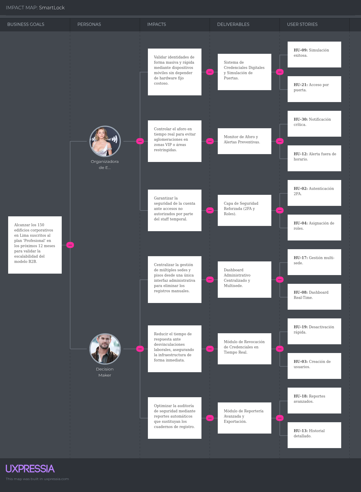
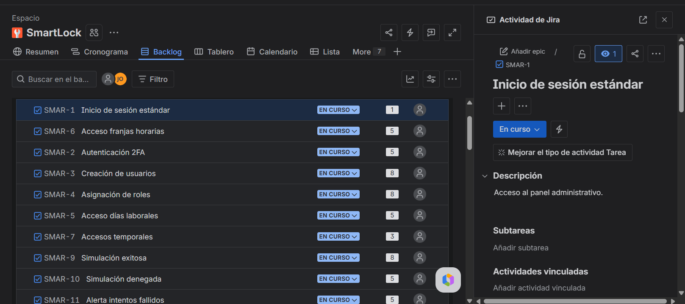

# Capítulo III: Requirements Specification

## 3.1. User Stories.

---

## Historias de Usuario Funcionales (30)

| ID | Título | Descripción | Criterios de Aceptación (Gherkin) | Relacionado con |
| :--- | :--- | :--- | :--- | :--- |
| **HU-01** | Inicio de sesión estándar | Acceso al panel administrativo. | **Dado** que el administrador está en el login, **Cuando** ingresa correo y clave correctos, **Entonces** accede al panel de control. | **EPIC-01** |
| **HU-02** | Autenticación 2FA | Verificación de identidad reforzada. | **Dado** que el personal ingresó clave válida, **Cuando** el sistema procesa el primer paso, **Entonces** solicita código 2FA y valida que no haya expirado. | **EPIC-01** |
| **HU-03** | Creación de usuarios | Registro de empleados/miembros. | **Dado** que el admin de RRHH está en el módulo, **Cuando** ingresa datos requeridos y correo único, **Entonces** el sistema registra al usuario. | **EPIC-02** |
| **HU-04** | Asignación de roles | Gestión de niveles de permiso. | **Dado** que se edita un usuario, **Cuando** se selecciona un rol (Staff/Limpieza), **Entonces** se asignan permisos automáticos del rol. | **EPIC-02** |
| **HU-05** | Acceso días laborales | Restricción por calendario. | **Dado** que el usuario tiene acceso L-V, **Cuando** intenta acceder un sábado, **Entonces** el sistema deniega y registra el evento. | **EPIC-03** |
| **HU-06** | Acceso franjas horarias | Restricción por horas. | **Dado** que el acceso es de 9AM a 6PM, **Cuando** intenta acceder 6:05PM, **Entonces** deniega la entrada y genera registro fallido. | **EPIC-03** |
| **HU-07** | Accesos temporales | Permisos con caducidad. | **Dado** que el permiso vence a las 5:00PM, **Cuando** el reloj marca las 5:01PM, **Entonces** el permiso se revoca automáticamente. | **EPIC-03** |
| **HU-08** | Dashboard Real-Time | Visualización de eventos. | **Dado** que el dashboard está abierto, **Cuando** ocurre un evento en cualquier puerta, **Entonces** aparece en la lista sin recargar la página. | **EPIC-04** |
| **HU-09** | Simulación exitosa | Prueba de flujo sin hardware. | **Dado** que se usa la web sin cerraduras, **Cuando** se simula acceso en puerta permitida, **Entonces** registra evento exitoso en dashboard. | **EPIC-05** |
| **HU-10** | Simulación denegada | Prueba de reglas de negocio. | **Dado** que se usa el simulador, **Cuando** se simula acceso en horario no permitido, **Entonces** genera registro rojo y dispara alertas. | **EPIC-05** |
| **HU-11** | Alerta intentos fallidos | Detección de intrusos. | **Dado** que el sistema está activo, **Cuando** hay >3 fallos en 5 min, **Entonces** genera alerta visual de seguridad. | **EPIC-04** |
| **HU-12** | Alerta fuera de horario | Notificación preventiva. | **Dado** que el monitoreo corre, **Cuando** hay intento de apertura fuera de franja, **Entonces** genera notificación destacada en panel. | **EPIC-04** |
| **HU-13** | Historial detallado | Auditoría de movimientos. | **Dado** que se ingresa a "Historial", **Cuando** carga la vista, **Entonces** muestra lista paginada con usuario, fecha, hora, puerta y estado. | **EPIC-06** |
| **HU-14** | Filtros de historial | Búsqueda avanzada de eventos. | **Dado** que hay miles de registros, **Cuando** se filtra por estado y fecha, **Entonces** la tabla muestra solo los criterios coincidentes. | **EPIC-06** |
| **HU-15** | Límites Plan Básico | Bloqueo por suscripción. | **Dado** que se alcanzó el límite de usuarios, **Cuando** se intenta crear uno nuevo, **Entonces** muestra modal para mejorar al Plan Profesional. | **EPIC-07** |
| **HU-16** | Upgrade Profesional | Escalabilidad de cuenta. | **Dado** que se completa el pago del Plan Profesional, **Cuando** se confirma, **Entonces** elimina límites y desbloquea control avanzado. | **EPIC-07** |
| **HU-17** | Gestión multi-sede | Centralización operativa. | **Dado** que se tiene Plan Empresarial, **Cuando** se accede al panel, **Entonces** permite crear y cambiar entre Sedes independientes. | **EPIC-07** |
| **HU-18** | Reportes avanzados | Análisis de flujo. | **Dado** que se tiene Plan Empresarial, **Cuando** se pide reporte de horas pico, **Entonces** exporta PDF/Excel con gráficas. | **EPIC-06** |
| **HU-19** | Desactivación rápida | Revocación instantánea. | **Dado** que se visualiza lista de empleados, **Cuando** se pulsa "Desactivar", **Entonces** el acceso se revoca en tiempo real en toda la red. | **EPIC-02** |
| **HU-20** | Gestión de Puertas | CRUD de infraestructura. | **Dado** que se configura el espacio, **Cuando** se entra a "Puertas", **Entonces** permite crear, editar y eliminar puntos de acceso. | **EPIC-03** |
| **HU-21** | Acceso por puerta | Permisos granulares. | **Dado** que se edita el rol "Limpieza", **Cuando** se marcan puertas específicas, **Entonces** deniega acceso en el resto de puertas. | **EPIC-03** |
| **HU-22** | Alerta uso indebido | Prevención de espionaje. | **Dado** que hay zonas restringidas, **Cuando** hay intento sin autorización, **Entonces** etiqueta como "Uso indebido" y emite alerta. | **EPIC-04** |
| **HU-23** | Reset de contraseña | Autogestión de cuenta. | **Dado** que el usuario olvidó su clave, **Cuando** la solicita, **Entonces** recibe enlace tokenizado válido por 15 minutos. | **EPIC-01** |
| **HU-24** | Exportación de datos | Descarga de reportes. | **Dado** que se aplicaron filtros en historial, **Cuando** se pulsa "Exportar", **Entonces** descarga CSV con los registros filtrados. | **EPIC-06** |
| **HU-25** | Cierre de alertas | Gestión de incidencias. | **Dado** que hay alerta activa, **Cuando** se pulsa "Resolver", **Entonces** desaparece de la vista y se archiva como resuelta. | **EPIC-04** |
| **HU-26** | Cierre de sesión | Seguridad de terminal. | **Dado** que el usuario está logueado, **Cuando** pulsa "Cerrar sesión", **Entonces** destruye el token y redirige al login. | **EPIC-01** |
| **HU-27** | Invitación masiva | Onboarding eficiente. | **Dado** que se carga lista de correos, **Cuando** se envía, **Entonces** cada empleado recibe link único para crear su clave. | **EPIC-02** |
| **HU-28** | Edición de perfil | Actualización de datos. | **Dado** que el usuario está autenticado, **Cuando** edita su perfil, **Entonces** permite cambiar foto/teléfono pero bloquea cambio de rol. | **EPIC-01** |
| **HU-29** | Alerta desconexión | Monitoreo de hardware. | **Dado** que se monitorea hardware, **Cuando** una puerta pierde red, **Entonces** el ícono en dashboard cambia a "Offline" o rojo. | **EPIC-04** |
| **HU-30** | Notificación crítica | Alerta vía email. | **Dado** que hay notificaciones activas, **Cuando** ocurre emergencia (madrugada), **Entonces** envía email automático al dueño. | **EPIC-04** |
| **HU-31** | Navegación fluida por secciones | **Como** visitante, **quiero** que al pulsar los enlaces del menú la página se deslice suavemente, **para** no perder el hilo de la lectura mientras busco información. | **Dado** que el usuario visualiza la `navbar`, **Cuando** hace clic en un enlace (ej. "Precios"), **Entonces** la pantalla se desplaza con un efecto de scroll suave hasta la sección con el ID `#pricing`. | **EPIC-10** |
| **HU-32** | Selector de idioma visual | **Como** usuario que habla inglés, **quiero** ver un botón claro para cambiar el idioma, **para** entender la propuesta de valor sin tener que usar traductores externos. | **Dado** que el usuario localiza el botón `lang-btn`, **Cuando** lo presiona, **Entonces** todos los textos con el atributo `data-i18n` deben actualizarse visualmente al idioma seleccionado. | **EPIC-11** |
| **HU-33** | Botón de acción resaltado | **Como** interesado en el producto, **quiero** que el botón de "Solicitar Demo" tenga un color llamativo, **para** identificar rápidamente dónde debo registrarme. | **Dado** que el usuario carga el Hero de la página, **Cuando** observa los botones de navegación, **Entonces** el botón `.btn-nav-blue` debe destacar visualmente sobre los enlaces de texto plano. | **EPIC-07** |
| **HU-34** | Tarjetas de beneficios visuales | **Como** usuario curioso, **quiero** ver las ventajas del sistema organizadas en tarjetas con iconos, **para** que la lectura sea ágil y atractiva. | **Dado** que el usuario hace scroll hasta `#features`, **Cuando** revisa las tarjetas `.feat-card`, **Entonces** cada una debe presentar un icono representativo, un título y una descripción breve. | **EPIC-10** |
| **HU-35** | Formulario de contacto limpio | **Como** cliente con dudas, **quiero** un formulario con espacios claros para escribir, **para** enviar mi consulta de forma rápida y sin distracciones visuales. | **Dado** que el usuario llega a la sección `#contact`, **Cuando** interactúa con los campos de texto, **Entonces** el diseño debe mostrar etiquetas legibles y un botón de "Enviar" que reaccione al pasar el cursor (hover). | **EPIC-07** |
| **HU-36** | Visualización de casos de uso | **Como** dueño de un negocio, **quiero** leer ejemplos de aplicación de SmartLock por sectores, **para** visualizar cómo el sistema resolvería mis problemas de seguridad. | **Dado** que el usuario explora la sección `#use-cases`, **Cuando** lee los bloques de contenido, **Entonces** la información debe estar separada visualmente en categorías (ej. Corporativo, Eventos). | **EPIC-10** |
| **HU-37** | Acceso rápido para clientes | **Como** usuario ya registrado, **quiero** un botón de "Iniciar Sesión" bien ubicado, **para** entrar a mi panel de control sin tener que navegar por toda la web. | **Dado** que el usuario está en el menú superior, **Cuando** busca el acceso a la plataforma, **Entonces** el botón `.btn-nav-gray` debe estar claramente diferenciado y llevarlo directo al login. | **EPIC-01** |
| **HU-38** | Tabla de precios comparativa | **Como** comprador consciente, **quiero** comparar los planes y sus precios en columnas, **para** elegir la opción que mejor se adapte a mi presupuesto de un vistazo. | **Dado** que el usuario visualiza la sección `#pricing`, **Cuando** revisa los planes (Básico, Pro, Enterprise), **Entonces** cada tarjeta debe listar sus características con iconos de "check" para facilitar la comparación. | **EPIC-07** |
| **HU-39** | Estadísticas de confianza | **Como** visitante nuevo, **quiero** ver cifras grandes sobre el éxito de la empresa, **para** sentir la seguridad de que SmartLock es una solución probada y confiable. | **Dado** que el usuario carga la página inicial, **Cuando** visualiza la fila `.stats-row`, **Entonces** los números (ej. +500 edificios) deben resaltar por su tamaño de fuente y grosor frente al texto secundario. | **EPIC-10** |
| **HU-40** | Adaptabilidad a pantallas móviles | **Como** usuario que navega desde su celular, **quiero** que todo el diseño se ajuste a lo ancho de mi pantalla, **para** no tener que hacer zoom o scroll horizontal para leer. | **Dado** que se accede a la web desde un smartphone, **Cuando** la resolución es menor a 768px, **Entonces** el menú debe adaptarse (hamburguesa) y los elementos del grid deben apilarse verticalmente. | **EPIC-10** |
---

## Historias de Usuario No Funcionales (30)

<<<<<<< HEAD

=======
>>>>>>> 078063ae4657911fb2e979558428d98cc822a940
| ID | Título | Descripción | Criterios de Aceptación (Gherkin) | Epic Relacionada |
| :--- | :--- | :--- | :--- | :--- |
| **HNF-01** | Latencia Dashboard | Actualización inmediata. | **Dado** que ocurre validación en puerta, **Cuando** la DB registra el evento, **Entonces** actualiza el dashboard en < 1 segundo. | **EPIC-08** |
| **HNF-02** | Rendimiento carga | Carga de plataforma. | **Dado** que se ingresa a la URL, **Cuando** el navegador pide recursos, **Entonces** la página es interactiva en un máximo de 2 segundos. | **EPIC-08** |
| **HNF-03** | Encriptación | Hashing de seguridad. | **Dado** que se crea/cambia clave, **Cuando** se guarda en DB, **Entonces** debe usarse bcrypt y nunca texto plano. | **EPIC-09** |
| **HNF-04** | Datos en tránsito | Cifrado de red. | **Dado** que la web habla con la API, **Cuando** viajan datos sensibles, **Entonces** debe usarse HTTPS con TLS 1.2+. | **EPIC-09** |
| **HNF-05** | Disponibilidad | Continuidad operativa. | **Dado** que el sistema está en producción, **Cuando** se mide el uptime mensual, **Entonces** debe ser >= 99.9%. | **EPIC-08** |
| **HNF-06** | Diseño Responsivo | Adaptabilidad móvil. | **Dado** que se usa un móvil (320px), **Cuando** accede al panel, **Entonces** la interfaz adapta elementos sin pérdida de función. | **EPIC-10** |
| **HNF-07** | Inmutabilidad logs | Integridad de auditoría. | **Dado** que un evento se escribió en DB, **Cuando** un admin intenta borrarlo, **Entonces** la API debe rechazar el UPDATE/DELETE. | **EPIC-06** |
| **HNF-08** | Escalabilidad | Capacidad de carga. | **Dado** que es hora pico (9AM), **Cuando** hay 500 peticiones simultáneas, **Entonces** el servidor responde en < 500ms sin caídas. | **EPIC-08** |
| **HNF-09** | Timeout sesión | Protección por olvido. | **Dado** que la sesión quedó abierta, **Cuando** pasan 15 min sin actividad, **Entonces** destruye sesión y redirige al login. | **EPIC-09** |
| **HNF-10** | Compatibilidad | Multi-navegador. | **Dado** que se usa Chrome/Safari/Firefox, **Cuando** se abre la plataforma, **Entonces** debe renderizar sin fallos visuales ni de consola. | **EPIC-10** |
| **HNF-11** | Tolerancia fallos | Aislamiento de errores. | **Dado** que el simulador tiene un crash, **Cuando** el usuario navega el resto, **Entonces** dashboard e historial siguen operando. | **EPIC-08** |
| **HNF-12** | Velocidad 2FA/Email | Entrega de correos. | **Dado** que se pide 2FA, **Cuando** se dispara solicitud, **Entonces** el correo llega en < 5 segundos a la bandeja del usuario. | **EPIC-08** |
| **HNF-13** | Accesibilidad | Normas WCAG. | **Dado** que se evalúan colores, **Cuando** se mide el contraste, **Entonces** debe cumplir nivel AA de WCAG 2.1. | **EPIC-10** |
| **HNF-14** | Anti-Brute Force | Bloqueo de ataques. | **Dado** que hay ataque de clave, **Cuando** hay 5 fallos en mismo correo, **Entonces** bloquea IP/Cuenta por 30 minutos. | **EPIC-09** |
| **HNF-15** | Data Isolation | Multi-tenancy real. | **Dado** que es un SaaS multi-empresa, **Cuando** un admin consulta, **Entonces** el esquema garantiza que no vea datos de otros clientes. | **EPIC-09** |
| **HNF-16** | Backups diarios | Respaldo de datos. | **Dado** que la info es crítica, **Cuando** es la ventana de mantenimiento, **Entonces** genera backup automático en nube segregada. | **EPIC-09** |
| **HNF-17** | Log de auditoría | Trazabilidad admin. | **Dado** que un admin cambia configuración, **Cuando** se ejecuta, **Entonces** registra quién, cuándo y qué cambió en log oculto. | **EPIC-06** |
| **HNF-18** | Mensajes de error | UX de fallos. | **Dado** que hay fallo de base de datos, **Cuando** la API falla, **Entonces** el frontend muestra mensaje amigable sin detalles técnicos. | **EPIC-10** |
| **HNF-19** | Rate Limiting | Protección de API. | **Dado** que un bot ataca la API, **Cuando** hay >100 req/min desde una IP, **Entonces** el Gateway bloquea con error 429. | **EPIC-09** |
| **HNF-20** | Velocidad Export | Procesamiento masivo. | **Dado** que se exportan 10,000 registros, **Cuando** se procesa, **Entonces** entrega el archivo en < 10 segundos. | **EPIC-08** |
| **HNF-21** | Complejidad clave | Validación de fortaleza. | **Dado** que se configura clave, **Cuando** es débil (1234), **Entonces** rechaza y exige 8 carac., número y símbolo. | **EPIC-09** |
| **HNF-22** | Soporte i18n | Internacionalización. | **Dado** que se desarrolla el código, **Cuando** se implementan textos, **Entonces** se envuelven en i18n para futuras traducciones. | **EPIC-11** |
| **HNF-23** | RTO | Recuperación desastres. | **Dado** que hay desastre total, **Cuando** se activa el DRP, **Entonces** el sistema opera en región secundaria en máximo 4 horas. | **EPIC-08** |
| **HNF-24** | Archivado datos | Cold Storage. | **Dado** que hay millones de registros, **Cuando** un log cumple 2 años, **Entonces** se mueve automáticamente a almacenamiento en frío. | **EPIC-06** |
| **HNF-25** | Consumo batería | Optimización móvil. | **Dado** que el dashboard corre 8h en tablet, **Cuando** se mide consumo, **Entonces** no debe causar drenaje excesivo ni calor. | **EPIC-08** |
| **HNF-26** | Seguridad OWASP | Sanitización de inputs. | **Dado** que hay ataque XSS/SQLi, **Cuando** se envían datos, **Entonces** el backend sanitiza y usa consultas parametrizadas. | **EPIC-09** |
| **HNF-27** | Sincronía NTP | Precisión temporal. | **Dado** que el log tiene valor legal, **Cuando** se registra evento, **Entonces** el servidor usa NTP para sincronía global exacta. | **EPIC-09** |
| **HNF-28** | Regla 3 clics | Arquitectura intuitiva. | **Dado** que se busca una función, **Cuando** se navega desde dashboard, **Entonces** se debe completar en máximo 3 clics. | **EPIC-10** |
| **HNF-29** | Design System | Consistencia UI. | **Dado** que hay nuevas pantallas, **Cuando** el usuario navega, **Entonces** los colores/espaciados deben ser uniformes. | **EPIC-10** |
| **HNF-30** | Health Checks | Monitoreo de salud. | **Dado** que falla un microservicio, **Cuando** el monitor consulta /health, **Entonces** detecta y notifica antes del reporte del cliente. | **EPIC-08** |

---
## Technical Stories

| ID | Título | Descripción | Criterios de Aceptación (Gherkin) |
| :--- | :--- | :--- | :--- |
| **TS-01** | Documentación OpenAPI | Implementar Swagger/OpenAPI para la documentación automática de la API. | El endpoint `/api/docs` debe mostrar todos los recursos, métodos y esquemas de respuesta actualizados. |
| **TS-02** | Estandarización de Respuestas | Crear un interceptor/formateador global para respuestas JSON consistentes. | Todas las respuestas deben seguir la estructura `{ "data": {}, "meta": {}, "errors": [] }`. |
| **TS-03** | Autenticación JWT | Implementar autenticación basada en JSON Web Tokens con rotación de Refresh Tokens. | El sistema debe emitir un `access_token` de corta duración y un `refresh_token` seguro en `HttpOnly cookie`. |
| **TS-04** | Paginación Global | Desarrollar un helper de paginación para endpoints de colecciones (Historial, Usuarios). | Los endpoints de lista deben aceptar parámetros `page` y `limit`, y devolver metadata de totalización. |
| **TS-05** | Middleware de Roles (RBAC) | Crear decoradores o middlewares para validar permisos por rol en los controladores. | Si un usuario con rol "Staff" intenta un `DELETE` en `/doors`, la API debe retornar un error `403 Forbidden`. |
| **TS-06** | Validación de DTOs | Implementar validación de esquemas de entrada (Data Transfer Objects) en cada request. | Cualquier payload que no cumpla con el tipo de dato o longitud debe ser rechazado con un error `400 Bad Request`. |
| **TS-07** | Manejo de Excepciones | Crear un Global Exception Filter para capturar errores y evitar fugas de stack trace. | En modo producción, los errores `500` no deben revelar detalles de la base de datos o líneas de código. |
| ****TS-08**** | CORS Policy | Configurar políticas de Cross-Origin Resource Sharing. | La API solo debe aceptar peticiones desde los dominios autorizados de la aplicación web y el simulador. |
<<<<<<< HEAD
=======

>>>>>>> 078063ae4657911fb2e979558428d98cc822a940
## Definición de Epics (Módulos Generales)

| Epic ID | Nombre de la Epic | Descripción |
| :--- | :--- | :--- |
| **EPIC-01** | **Gestión de Identidad y Cuenta** | Todo lo relacionado con autenticación, seguridad de perfil y acceso inicial al sistema. |
| **EPIC-02** | **Administración de Personal (RRHH)** | Gestión del ciclo de vida del usuario: creación, asignación de roles, desactivación e invitaciones. |
| **EPIC-03** | **Configuración de Infraestructura y Reglas** | Definición de puertas físicas y las reglas de negocio (horarios, días, accesos temporales). |
| **EPIC-04** | **Centro de Monitoreo y Alertas** | El "corazón" operativo: dashboard en tiempo real, gestión de alertas e indicadores de estado. |
| **EPIC-05** | **Entorno de Simulación (Virtual Lock)** | Módulo para clientes sin hardware que permite probar la lógica de acceso digitalmente. |
| **EPIC-06** | **Auditoría, Reportes e Integridad** | Registro histórico, exportación de datos, analítica avanzada y protección de la inmutabilidad de logs. |
| **EPIC-07** | **Ecosistema Comercial y Suscripciones** | Manejo de tiers (Básico, Pro, Enterprise), límites de cuenta y gestión multi-sede. |
| **EPIC-08** | **Rendimiento, Disponibilidad y Escalabilidad** | Calidad del sistema en términos de velocidad, estabilidad frente a carga y recuperación ante fallos. |
| **EPIC-09** | **Capa de Seguridad y Ciberdefensa** | Normas técnicas de encriptación, protocolos de red, protección contra ataques y privacidad de datos. |
| **EPIC-10** | **Experiencia de Usuario (UX/UI)** | Consistencia visual, accesibilidad, diseño responsivo y usabilidad general. |
| **EPIC-11** | **Escalabilidad Global e i18n** | Preparación técnica del software para mercados internacionales y multi-idioma. |

## 3.2. Impact Mapping

<<<<<<< HEAD
| |
=======
| |
>>>>>>> 078063ae4657911fb2e979558428d98cc822a940

## 3.3. Product Backlog

## Product Backlog Priorizado

| # Orden | User Story Id | Título | Descripción | Story Points (1 / 2 / 3 / 5 / 8) |
| :--- | :--- | :--- | :--- | :--- |
| 1 | **HU-01** | Inicio de sesión estándar | Como administrador, deseo ingresar con correo y clave para acceder al panel de control. | 8 |
| 2 | **HU-03** | Creación de usuarios | Como admin de RRHH, deseo registrar empleados con correo único para gestionar el acceso al personal. | 8 |
| 3 | **HU-04** | Asignación de roles | Como administrador, deseo asignar roles específicos para automatizar los permisos de cada usuario. | 8 |
| 4 | **HU-08** | Dashboard Real-Time | Como monitor de seguridad, deseo ver los eventos en tiempo real para reaccionar ante incidencias sin recargar la web. | 8 |
| 5 | **HU-09** | Simulación exitosa | Como desarrollador, deseo simular accesos permitidos para validar el flujo del sistema sin hardware físico. | 8 |
| 6 | **HU-13** | Historial detallado | Como auditor, deseo ver una lista paginada de movimientos para fiscalizar quién entró y a qué hora. | 8 |
| 7 | **HU-19** | Desactivación rápida | Como administrador, deseo revocar accesos instantáneamente para proteger la red ante despidos o emergencias. | 8 |
| 8 | **HU-20** | Gestión de Puertas | Como administrador, deseo configurar puntos de acceso para organizar la infraestructura física del sistema. | 8 |
| 9 | **HU-26** | Cierre de sesión | Como usuario, deseo cerrar mi sesión para destruir el token de acceso y proteger mi cuenta. | 8 |
| 10 | **HNF-03** | Encriptación de claves | Como responsable de seguridad, deseo usar hashing bcrypt para que las claves nunca se guarden en texto plano. | 8 |
| 11 | **HNF-04** | Datos en tránsito | Como usuario, deseo que la comunicación sea vía HTTPS para proteger mis datos sensibles durante el envío. | 8 |
| 12 | **HNF-15** | Data Isolation | Como cliente corporativo, deseo un esquema multi-empresa para garantizar que nadie más vea mis datos. | 8 |
| 13 | **HNF-26** | Seguridad OWASP | Como desarrollador, deseo sanitizar todos los inputs para prevenir ataques de inyección SQL o XSS. | 8 |
| 14 | **TS-03** | Autenticación JWT | Como arquitecto, deseo implementar tokens JWT con rotación para asegurar una autenticación persistente y segura. | 8 |
| 15 | **TS-05** | Middleware de Roles | Como desarrollador, deseo crear decoradores RBAC para restringir el acceso a la API según el rol del usuario. | 8 |
| 16 | **TS-06** | Validación de DTOs | Como desarrollador, deseo validar los esquemas de entrada para rechazar peticiones mal formadas. | 8 |
| 17 | **TS-08** | CORS Policy | Como arquitecto, deseo configurar políticas CORS para que solo dominios autorizados consuman la API. | 8 |
| 18 | **HU-02** | Autenticación 2FA | Como usuario, deseo una verificación de segundo paso para añadir una capa extra de seguridad a mi cuenta. | 5 |
| 19 | **HU-05** | Acceso días laborales | Como administrador, deseo restringir el acceso por calendario para evitar ingresos no autorizados en días no laborables. | 5 |
| 20 | **HU-06** | Acceso franjas horarias | Como administrador, deseo limitar el acceso por horas para asegurar que el personal entre solo en su turno. | 5 |
| 21 | **HU-10** | Simulación denegada | Como desarrollador, deseo simular accesos fallidos para verificar que las reglas de negocio disparen las alertas correctas. | 5 |
| 22 | **HU-11** | Alerta intentos fallidos | Como monitor de seguridad, deseo detectar ataques de fuerza bruta para bloquear intrusos a tiempo. | 5 |
| 23 | **HU-21** | Acceso por puerta | Como administrador, deseo asignar permisos por puerta específica para controlar zonas restringidas. | 5 |
| 24 | **HU-23** | Reset de contraseña | Como usuario, deseo recuperar mi acceso mediante un enlace temporal para autogestionar mi cuenta. | 5 |
| 25 | **HU-29** | Alerta desconexión | Como administrador, deseo saber si una puerta pierde conexión para realizar mantenimiento preventivo inmediato. | 5 |
| 26 | **HNF-01** | Latencia Dashboard | Como usuario, deseo actualizaciones en menos de 1 segundo para tener una experiencia fluida y reactiva. | 5 |
| 27 | **HNF-05** | Disponibilidad | Como cliente, deseo un uptime del 99.9% para asegurar que el control de acceso nunca se detenga. | 5 |
| 28 | **HNF-06** | Diseño Responsivo | Como usuario móvil, deseo una interfaz adaptable para gestionar el sistema desde mi smartphone. | 5 |
| 29 | **HNF-07** | Inmutabilidad logs | Como auditor, deseo que los logs sean de solo lectura para garantizar la integridad de las pruebas legales. | 5 |
| 30 | **HNF-11** | Tolerancia fallos | Como administrador, deseo que el sistema sea modular para que un fallo en un servicio no tumbe toda la plataforma. | 5 |
| 31 | **HNF-14** | Anti-Brute Force | Como sistema de seguridad, deseo bloquear IPs tras 5 fallos para mitigar ataques automatizados. | 5 |
| 32 | **HNF-16** | Backups diarios | Como administrador de IT, deseo respaldos diarios automáticos para recuperar el sistema ante desastres. | 5 |
| 33 | **HNF-19** | Rate Limiting | Como desarrollador, deseo limitar las peticiones por minuto para proteger la API contra bots y abusos. | 5 |
| 34 | **HNF-21** | Complejidad clave | Como sistema, deseo exigir claves fuertes para reducir el riesgo de cuentas vulneradas. | 5 |
| 35 | **HNF-30** | Health Checks | Como equipo de DevOps, deseo monitorear la salud de los microservicios para detectar caídas antes que el usuario. | 5 |
| 36 | **TS-02** | Estandarización de Respuestas | Como desarrollador frontend, deseo una estructura JSON única para facilitar el consumo de datos. | 5 |
| 37 | **TS-04** | Paginación Global | Como desarrollador, deseo implementar paginación en las listas para optimizar el rendimiento de la red. | 5 |
| 38 | **TS-07** | Manejo de Excepciones | Como usuario, deseo ver mensajes de error amigables para entender qué falló sin ver detalles técnicos. | 5 |
| 39 | **HU-07** | Accesos temporales | Como recepcionista, deseo crear permisos con caducidad para gestionar visitas de forma automática. | 3 |
| 40 | **HU-12** | Alerta fuera de horario | Como vigilante, deseo recibir notificaciones destacadas para identificar intentos de acceso sospechosos. | 3 |
| 41 | **HU-14** | Filtros de historial | Como auditor, deseo filtrar por fecha y estado para encontrar registros específicos rápidamente. | 3 |
| 42 | **HU-15** | Límites Plan Básico | Como dueño del producto, deseo restringir el número de usuarios para incentivar el upgrade a planes premium. | 3 |
| 43 | **HU-16** | Upgrade Profesional | Como cliente, deseo pagar por el Plan Pro para desbloquear funciones avanzadas y eliminar límites. | 3 |
| 44 | **HU-17** | Gestión multi-sede | Como gerente, deseo cambiar entre sedes independientes para centralizar la operación de mi empresa. | 3 |
| 45 | **HU-22** | Alerta uso indebido | Como administrador, deseo etiquetar intentos sin autorización para prevenir espionaje interno. | 3 |
| 46 | **HU-24** | Exportación de datos | Como administrativo, deseo descargar reportes en CSV para realizar análisis externos o presentaciones. | 3 |
| 47 | **HU-25** | Cierre de alertas | Como operador, deseo marcar alertas como resueltas para mantener el panel de monitoreo limpio. | 3 |
| 48 | **HU-30** | Notificación crítica | Como dueño de negocio, deseo recibir emails automáticos en emergencias para estar informado 24/7. | 3 |
| 49 | **HNF-02** | Rendimiento carga | Como usuario, deseo que la página sea interactiva en menos de 2 segundos para no perder tiempo esperando. | 3 |
| 50 | **HNF-08** | Escalabilidad | Como sistema, deseo soportar 500 peticiones simultáneas para garantizar estabilidad en horas pico. | 3 |
| 51 | **HNF-09** | Timeout sesión | Como administrador de seguridad, deseo que las sesiones inactivas expiren para evitar accesos indebidos en PCs desatendidas. | 3 |
| 52 | **HNF-10** | Compatibilidad | Como usuario, deseo usar cualquier navegador moderno para acceder al sistema sin errores visuales. | 3 |
| 53 | **HNF-12** | Velocidad 2FA/Email | Como usuario, deseo recibir correos en menos de 5 segundos para no interrumpir mi flujo de trabajo. | 3 |
| 54 | **HNF-17** | Log de auditoría | Como administrador principal, deseo registrar cambios de configuración para saber quién modificó las reglas del sistema. | 3 |
| 55 | **HNF-23** | RTO (Recuperación) | Como administrador de sistemas, deseo recuperar la operación en máximo 4 horas tras un desastre total. | 3 |
| 56 | **HNF-27** | Sincronía NTP | Como sistema legal, deseo usar servidores NTP para que todos los registros tengan una hora exacta y válida. | 3 |
| 57 | **TS-01** | Documentación OpenAPI | Como desarrollador, deseo una documentación Swagger automática para facilitar la integración de nuevos módulos. | 3 |
| 58 | **HU-18** | Reportes avanzados | Como gerente, deseo gráficas de horas pico para optimizar el personal en mi establecimiento. | 2 |
| 59 | **HU-27** | Invitación masiva | Como admin de RRHH, deseo enviar links únicos a múltiples correos para agilizar el onboarding de empleados. | 2 |
| 60 | **HU-28** | Edición de perfil | Como usuario, deseo actualizar mis datos de contacto y foto para mantener mi perfil al día. | 2 |
| 61 | **HNF-13** | Accesibilidad WCAG | Como usuario con discapacidad, deseo una interfaz con alto contraste para navegar sin dificultades. | 2 |
| 62 | **HNF-18** | UX de fallos | Como usuario, deseo interfaces claras que me guíen cuando ocurre un error de conexión o datos. | 2 |
| 63 | **HNF-20** | Velocidad Export | Como administrativo, deseo procesar descargas masivas en menos de 10 segundos para ser más eficiente. | 2 |
| 64 | **HNF-29** | Design System | Como diseñador, deseo una UI consistente para que la experiencia de usuario sea uniforme en todas las pantallas. | 2 |
| 65 | **HNF-22** | Soporte i18n | Como administrador global, deseo que el sistema esté preparado para traducciones para expandir el negocio a otros países. | 1 |
| 66 | **HNF-24** | Archivado datos | Como administrador de IT, deseo mover logs antiguos a almacenamiento frío para reducir costos de base de datos. | 1 |
| 67 | **HNF-25** | Consumo batería | Como guardia con tablet, deseo que la app esté optimizada para no agotar la batería durante el turno. | 1 |
| 68 | **HNF-28** | Regla 3 clics | Como usuario, deseo llegar a cualquier función principal en máximo 3 clics para mejorar mi productividad. | 1 |
---
<<<<<<< HEAD
=======

* Evidencia de herramienta utilizada : **Jira : **

| |

* Evidencia de herramienta utilizada : **Jira : **

| |

* Evidencia de herramienta utilizada : **Jira : **

| |

<https://upc-team-open-source.atlassian.net/jira/software/projects/SMAR/boards/1?atlOrigin=eyJpIjoiNDFhNzk1OTIxMGU0NDc5ZjlmYjliMzlmYjU2MDVmOTIiLCJwIjoiaiJ9>
>>>>>>> 078063ae4657911fb2e979558428d98cc822a940
