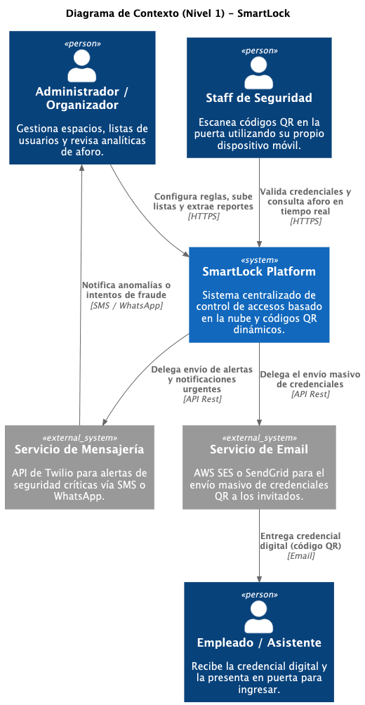
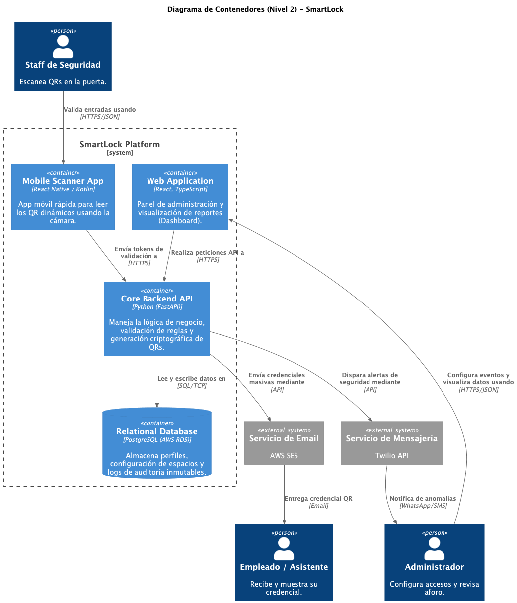
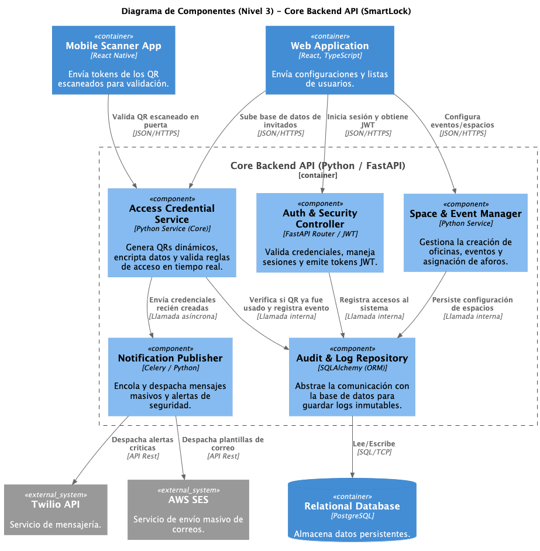
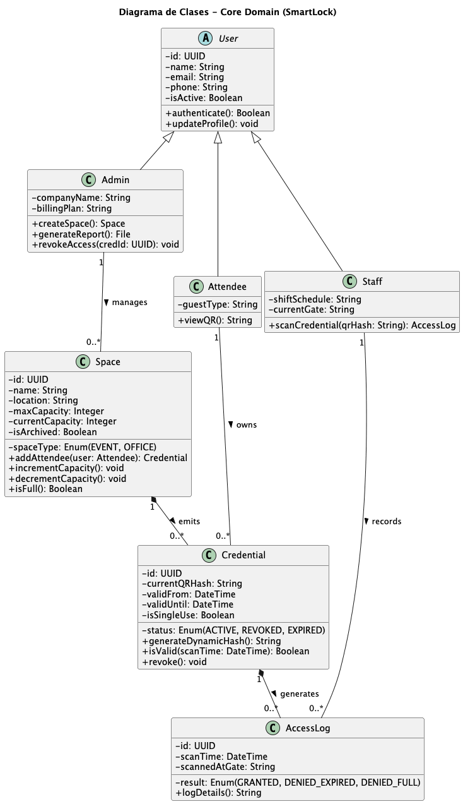
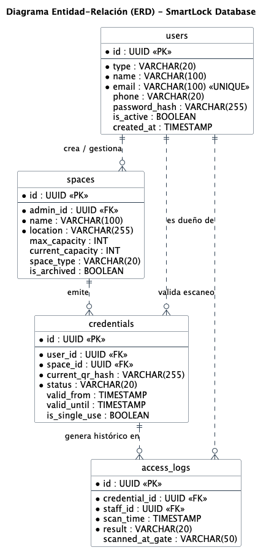

# Capítulo IV: Product Design

## 4.1. Style Guidelines.
Se describen las directrices que aseguran la uniformidad 
estética del proyecto. 

### 4.1.1. General Style Guidelines.
**Colors:**
 
Elegimos una paleta que grite **seguridad y tecnología**, pero sin cansar la vista (pensando en administradores que estarán pegados al dashboard monitoreando accesos).
 
* **Azul Oscuro (#1B263B):** Es nuestro color estrella. Da esa seriedad y confianza que necesitas cuando hablas de controlar quién entra a tu edificio u oficina.
* **Casi Negro (#0D1B2A):** Lo usamos para los textos importantes. No es negro puro porque eso agota la vista en sesiones largas, pero tiene el peso suficiente para que se lea claro.
* **Gris Neutro (#E0E1DD):** Este va de fondo en las secciones. Es limpio y hace que los demás elementos resalten sin esfuerzo.
* **Azul Eléctrico (#3E92CC):** Este es nuestro "call to action". Si hay algo que el usuario tiene que clickear sí o sí (como el botón de "Abrir Puerta" o "Guardar Configuración"), va en este color.

**Branding** 
El logo de **SmartLock** es directo al grano: un **candado**. Elegimos este isotipo porque es el símbolo universal de la seguridad física; no necesitamos complicarlo con más adornos para que el usuario entienda qué hacemos. Lo que lo hace moderno es su diseño minimalista y limpio. Acompañando al candado, la tipografía del nombre es sólida y de cortes precisos. Queríamos que la identidad visual transmitiera esa firmeza y robustez que se espera de un sistema de seguridad confiable, alejándonos de cualquier estética que pudiera parecer "frágil" o improvisada.

**Typography**  
Nos fuimos por **Inter**. ¿Por qué? Porque cuando tienes una lista gigante de registros de entrada y salida, necesitas una letra que se lea perfecto en pantallas de cualquier tamaño. Es una fuente *sans-serif* optimizada para entornos digitales.
* **Bold:** Para los títulos de sección y alertas que no puedes ignorar.
* **Semi-Bold:** Para encabezados de tablas o nombres de usuarios.
* **Regular:** Para el cuerpo de texto y los logs de acceso.
* *Referencia:* [Inter - Google Fonts](https://fonts.google.com/specimen/Inter)

**Spacing** 
Para que no todo esté tirado al azar, usamos la regla de los **8px**. Si vas a separar algo, que sea múltiplo de 8. En el código, **solo usamos `rem`** para que la interfaz sea escalable y se adapte bien si el usuario cambia el tamaño de fuente de su navegador.

| Categoría | Medida (rem / px) | Aplicación en el Diseño |
| :--- | :--- | :--- |
| **X-Small** | 0.25 rem / 4 px | Alineación de iconos y micro-ajustes de posición. |
| **Small** | 0.5 rem / 8 px | Espacio entre un texto y su campo de entrada (input). |
| **Medium** | 1.0 rem / 16 px | Relleno interno (padding) de botones y tarjetas. |
| **Large** | 1.5 rem / 24 px | Margen entre componentes de un mismo bloque funcional. |
| **X-Large** | 2.0 rem / 32 px | Distancia entre contenedores de información independientes. |
| **Section** | 4.0 rem / 64 px | El espacio grande entre bloques estructurales de la página. |

> **Nota técnica:** Queda prohibido usar píxeles (`px`) estáticos para márgenes o paddings. Todo debe ir en `rem` siguiendo la escala de arriba.

**Dimensions (Tono y Comunicación)** 
El estilo de comunicación de SmartLock es **directo y técnico**. Como ingenieros, no queremos meterle "floro" innecesario al usuario.
* Si alguien intenta entrar y no tiene permiso, el sistema dice **"Acceso Denegado"**, sin vueltas.
* Usamos términos que un jefe de seguridad entienda rápido (como "Trazabilidad", "Cifrado" o "Autenticación").
* La idea es que la plataforma sea una herramienta de trabajo estricta, libre de narrativa irrelevante, para que la toma de decisiones sea rápida.

---

### 4.1.2. Web Style Guidelines

Aquí es donde aterrizamos todo para que la plataforma web se vea de nivel profesional:

1.  **Cero Adornos:** Si un botón o un icono no ayuda a monitorear o gestionar la seguridad, se quita. Queremos una interfaz limpia donde el control sea el protagonista.
2.  **Todo es Responsive:** El administrador puede estar en su oficina con un monitor gigante o en la entrada con su tablet. La estructura no debe romperse y los elementos deben ser fáciles de tocar/clickear en cualquier dispositivo.
3.  **Jerarquía Visual:** Usamos el contraste y los colores semánticos para que el ojo sepa qué es urgente.
  * **Rojo:** Alertar brechas de seguridad o intentos fallidos.
  * **Verde/Azul:** Accesos válidos y sistema operativo.
  * **Amarillo:** Dar advertencias ante cualquier problema. 
## 4.2. Information Architecture.
En SmartLock, la arquitectura de la información no es solo un menú de opciones; es el cerebro que permite que un administrador no entre en pánico cuando hay cientos de personas moviéndose por sus instalaciones. En el mundo de la seguridad digital, un segundo de duda puede ser un problema grave. Por eso, hemos diseñado una estructura donde la información crítica (como quién entró por la puerta principal hace un segundo) siempre está a la vista, eliminando cualquier "floro" visual que distraiga de lo importante: el control total y en tiempo real.

---

### 4.2.1. Organization Systems.
Para que SmartLock sea realmente eficiente tanto para el guardia en la puerta como para el administrador del sistema, hemos decidido combinar varios sistemas de organización:

### **Organización visual del contenido**
* **Jerárquica (Visual Hierarchy):** Elegimos este sistema porque en seguridad hay datos que "gritan" más fuerte que otros. En el Dashboard, los intentos de acceso fallidos o las alertas de puertas forzadas utilizan un tamaño y color prominente (rojo/bold). No es solo estética; es una estrategia para que el ojo del usuario sepa qué atender primero sin tener que leer toda la pantalla.
* **Organización secuencial (Step-by-step):** Registrar una nueva cerradura inteligente o dar de alta a un nuevo usuario puede ser tedioso. Lo dividimos en pasos claros (Identificación > Asignación de Permisos > Vinculación de Hardware) para evitar que el usuario se sienta abrumado y garantizar que no se salte ningún protocolo de seguridad.

### **Esquemas de categorización de contenido**
* **Por tópicos (Zonas de Acceso):** Organizamos la info por "Zonas" (ej. Piso 1, Almacén, Oficinas). Es la forma más lógica en la que un administrador piensa su espacio físico.
* **Según audiencia (Roles de Usuario):** El "Usuario Final" solo ve su llave digital y su historial personal. El "Administrador" ve todo el panel de control y analíticas. Esto "limpia" la interfaz de cada usuario, mostrándole solo lo que es relevante para su rol.
* **Cronológico:** Es vital para el Log de Eventos. Si pasa algo, necesitamos reconstruir la historia de forma lineal. Mostramos los ingresos por hora y fecha para que la trazabilidad sea impecable.
* **Alfabético:** Lo reservamos para el directorio de usuarios y empleados, donde la búsqueda por nombre de la A a la Z es la forma más rápida de encontrar a alguien.

---
### 4.2.2. Labeling Systems.

En el sistema de etiquetado de SmartLock, hemos huido del lenguaje genérico. Queremos que el usuario sienta que el software es una herramienta técnica y profesional:

* **Panel de Control:** En lugar de "Inicio", porque aquí es donde realmente se gestiona todo el hardware.
* **Bitácora de Accesos:** Suena más profesional que "Historial". Da la idea de un registro oficial y serio de cada movimiento para auditorías.
* **Credenciales Digitales:** Término usado para referirse a los permisos de acceso de los usuarios, reforzando la idea de seguridad y autenticación.
* **Puntos de Control:** En lugar de "Puertas", porque SmartLock puede controlar desde una puerta hasta un torniquete o una barrera vehicular.

---

### 4.2.3. SEO Tags and Meta Tags
Queremos que SmartLock sea lo primero que aparezca cuando una empresa busque modernizar su seguridad.

### **Landing Page**
* **Título:** `<title>SmartLock | Control de Accesos Inteligente y Seguridad Digital</title>`
* **Descripción:** `<meta name="description" content="Moderniza la seguridad de tu edificio. SmartLock ofrece gestión de accesos en tiempo real, trazabilidad total y control desde la nube para oficinas y universidades."/>`
* **Keywords:** `<meta name="keywords" content="SmartLock, Control de accesos, Seguridad digital, Cerraduras inteligentes, Trazabilidad, SmartTecnologies, Software de seguridad Perú, ConTech."/>`
* **Autor:** `<meta name="author" content="SmartTecnologies" />`

### **Web Application**
* **Título:** `<title>Dashboard SmartLock - Gestión de Accesos</title>`
* **Descripción:** `<meta name="description" content="Panel de administración de SmartLock. Monitorea ingresos, gestiona usuarios y configura tus puntos de control en tiempo real."/>`

---

### 4.2.4. Searching Systems.
No queremos que el usuario "busque", queremos que "encuentre" rápido:

* **Búsqueda Predictiva:** A medida que el administrador escribe (ej. un DNI o nombre), el sistema sugiere usuarios registrados para ahorrar tiempo.
* **Filtros de Facetas:** El usuario puede refinar los registros por **Rango de fechas**, **Zona de acceso**, **Estado de ingreso** (Exitoso/Denegado) y **Tipo de usuario**, evitando la sobrecarga de información.
* **Búsqueda por Dispositivo:** Permite localizar rápidamente una cerradura o sensor específico dentro de toda la infraestructura mediante su ID técnico.

---
### 4.2.5. Navigation Systems.
La navegación en SmartLock está pensada para ser "invisible" y eficiente:

* **Menú Lateral Retráctil:** Prioriza el espacio de trabajo central para ver los mapas de calor y tablas de acceso, manteniendo los módulos principales a un solo clic.
* **Migas de Pan (Breadcrumbs):** Vital para no perderse cuando navegas por sedes (ej. Sedes > Lima Centro > Piso 3 > Laboratorio A), permitiendo al usuario ubicarse en todo momento.
* **Acciones Contextuales:** El sistema ofrece botones inteligentes según el estado del punto de control (ej. si una puerta detecta una intrusión, el botón principal será "Bloquear Acceso" o "Contactar Seguridad").
## 4.3. Landing Page UI Design.
### 4.3.1. Landing Page Wireframe.
### 4.3.2. Landing Page Mock-up.
## 4.4. Web Applications UX/UI Design.
### 4.4.1. Web Applications Wireframes.
### 4.4.2. Web Applications Wireflow Diagrams.
### 4.4.3. Web Applications Mock-ups.
### 4.4.4. Web Applications User Flow Diagrams.
## 4.5. Web Applications Prototyping.
## 4.6. Domain-Driven Software Architecture

En esta sección se define la arquitectura de software de **SmartLock** utilizando los principios de Diseño Orientado al Dominio (Domain-Driven Design - DDD). Nuestro enfoque busca alinear la complejidad técnica del sistema con las necesidades reales del negocio (control de accesos "Asset-Light"). 

Para la representación de la arquitectura, utilizaremos el **Modelo C4**, el cual nos permite visualizar el sistema en diferentes niveles de abstracción (Contexto, Contenedores y Componentes), facilitando la comprensión tanto para *stakeholders* de negocio como para el equipo de desarrollo. El stack tecnológico base seleccionado incluye React con TypeScript para el Frontend, Python para el Backend, y despliegue en la infraestructura de AWS.

### 4.6.1. Design-Level Event Storming
### 4.6.2. Software Architecture Context Diagram

El diagrama de contexto (Nivel 1 del Modelo C4) ilustra a **SmartLock** como una caja negra en el centro de su ecosistema, mostrando las interacciones de alto nivel con los usuarios (Administradores, Staff y Asistentes) y los sistemas externos de los cuales depende para funcionar (proveedores de nube y mensajería).

**Descripción de las interacciones:**
1. **Administradores / Organizadores:** Interactúan con el sistema para configurar espacios, cargar listas de usuarios y descargar reportes.
2. **Staff de Seguridad:** Utilizan el sistema (vía móvil) exclusivamente para escanear y validar credenciales.
3. **Empleados / Asistentes:** Interactúan pasivamente al recibir su credencial digital y mostrarla en puerta.
4. **Sistemas Externos:** SmartLock delega el envío masivo de correos a un proveedor externo (AWS SES) y las notificaciones a un servicio de mensajería (Twilio API).

### 4.6.3. Software Architecture Container Diagrams

El **Diagrama de Contenedores (Nivel 2 del Modelo C4)** hace un "zoom" a la plataforma SmartLock para revelar su estructura técnica interna. En esta sección se detallan las aplicaciones web, aplicaciones móviles, bases de datos y APIs que conforman el sistema.

* **1. Web Application (Frontend):** Desarrollada en React con TypeScript. Es el panel de control tipo SPA donde los administradores configuran sus espacios y visualizan métricas.
* **2. Mobile Application (Scanner App):** App móvil rápida para el Staff de seguridad, diseñada para leer los QR dinámicos usando la cámara con latencia mínima.
* **3. Core Backend API:** Desarrollada en Python (FastAPI). Contiene toda la lógica de negocio, generación de códigos QR encriptados y validación de reglas de acceso.
* **4. Relational Database:** Base de datos PostgreSQL (AWS RDS) que almacena los perfiles, espacios y el registro inmutable de auditoría.

### 4.6.4. Software Architecture Components Diagrams

El **Diagrama de Componentes (Nivel 3 del Modelo C4)** hace un acercamiento al contenedor principal: el **Core Backend API**. Este diagrama expone la arquitectura interna organizada modularmente según los principios de DDD.

* **1. Auth & Security Controller:** Punto de entrada para la autenticación y emisión de tokens JWT.
* **2. Space & Event Manager:** Gestiona la creación de locaciones físicas y asignación de aforos.
* **3. Access Credential Service (Core Domain):** Recibe la lista de usuarios, genera códigos QR dinámicos con firma criptográfica y evalúa reglas de negocio en tiempo real.
* **4. Notification Publisher:** Componente asíncrono que delega el envío de correos y alertas a servicios externos.
* **5. Audit & Log Repository:** Registra cada intento de acceso en la base de datos garantizando un historial inmutable.

## 4.7. Software Object-Oriented Design

En esta sección se detalla el diseño orientado a objetos del sistema **SmartLock**, traduciendo los requerimientos de negocio y la arquitectura del dominio en estructuras de software concretas mediante el paradigma POO. Se definen las clases principales, sus atributos, métodos y las relaciones (herencia, agregación y composición) que interactúan dentro del *Core Backend API*.

### 4.7.1. Class Diagrams

El siguiente diagrama de clases ilustra el modelo de dominio central del sistema. Se ha aplicado el principio de herencia para gestionar los diferentes tipos de usuarios (`Admin`, `Staff` y `Attendee`) a partir de una clase base común `User`. Asimismo, se detalla la relación central del negocio: un `Space` emite múltiples `Credentials` (QR dinámicos), las cuales, al ser escaneadas por el `Staff`, generan instancias de `AccessLog`.

## 4.8. Database Design

En esta sección se detalla el diseño relacional de la base de datos de **SmartLock**, implementada utilizando el motor **PostgreSQL** en AWS RDS. El diseño garantiza la integridad referencial, la normalización de los datos (hasta la tercera forma normal) y la optimización para consultas de alta concurrencia, aspectos críticos para un sistema de control en tiempo real.

### 4.8.1. Database Diagrams

A continuación, se presenta el Diagrama Entidad-Relación (ERD) físico del sistema central utilizando la notación *Crow's Foot*. Este modelo define las tablas principales (`users`, `spaces`, `credentials` y `access_logs`), los tipos de datos, y las llaves primarias (PK) y foráneas (FK) que establecen las relaciones estructurales.

